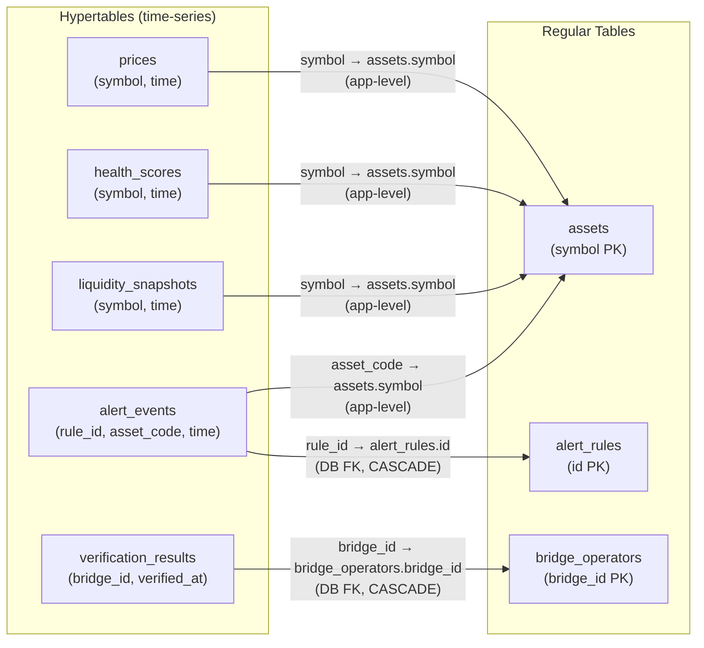
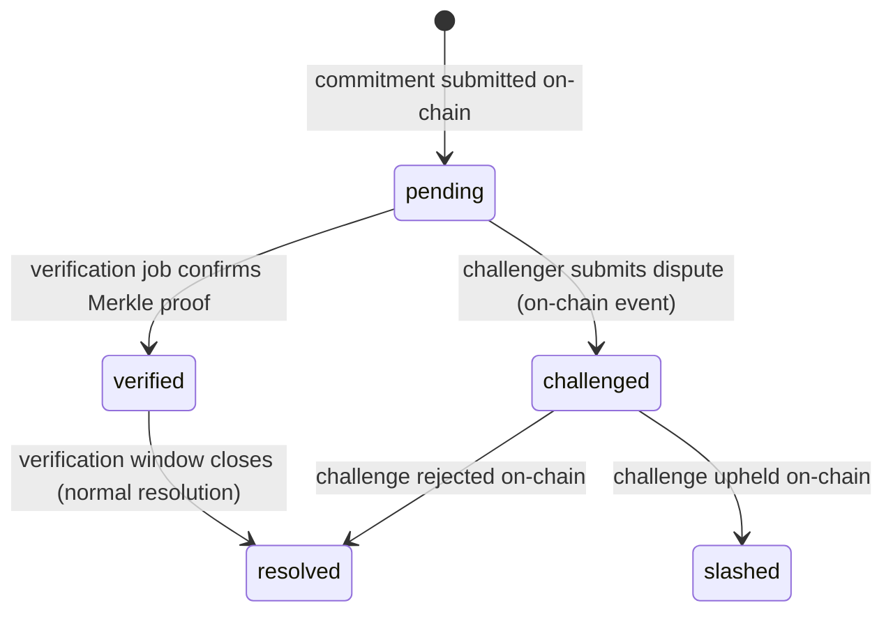
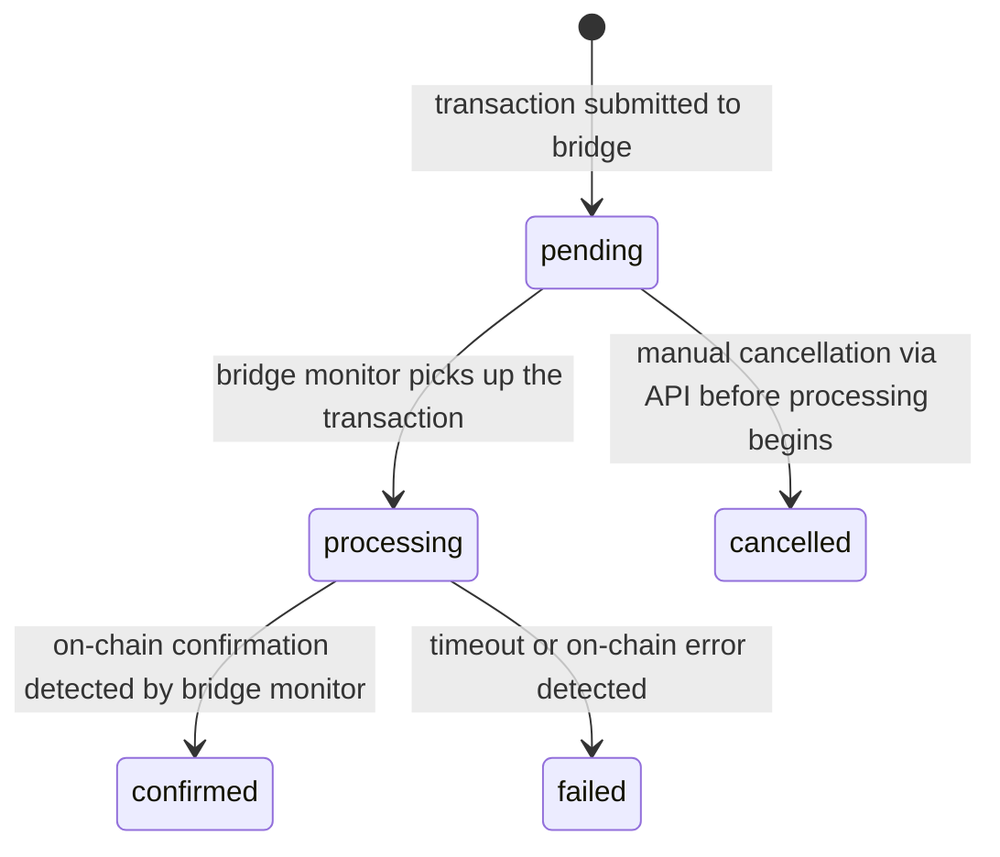
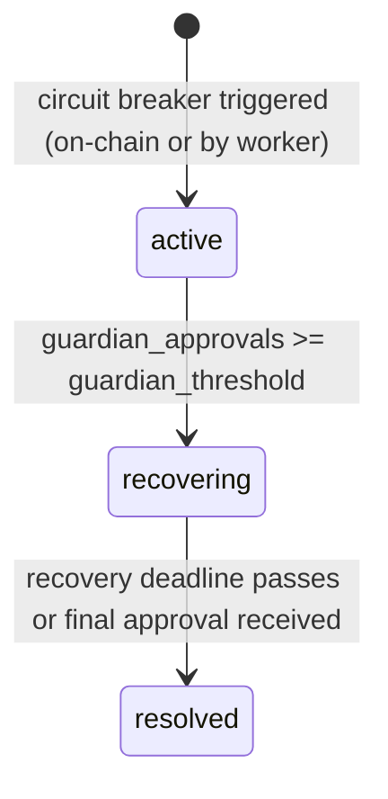

# Data Model Reference — Stellar Bridge Watch

> **Last updated:** see git log  
> **Canonical sources:** [`schema.sql`](../src/database/schema.sql) · [`types.ts`](../src/database/types.ts) · [`migrations/`](../src/database/migrations/)

---

## Table of Contents

1. [Introduction & Source of Truth](#1-introduction--source-of-truth)
2. [Naming Conventions](#2-naming-conventions)
3. [Entity Reference](#3-entity-reference)
4. [Relationship Diagrams](#4-relationship-diagrams)
5. [Entity Lifecycles](#5-entity-lifecycles)
6. [Storage & Retention](#6-storage--retention)
7. [Update Workflow](#7-update-workflow)

---

## 1. Introduction & Source of Truth

### 1.1 The Three Canonical Files

| File | Role |
|------|------|
| `backend/src/database/schema.sql` | Human-readable reference for the full schema. **Not run directly in production.** |
| `backend/src/database/migrations/` | **Production source of truth.** Every schema change must be expressed as a migration. Run via `npm run migrate`. |
| `backend/src/database/types.ts` | **TypeScript source of truth.** Interfaces mirror the SQL schema and must be kept in sync manually after every migration. |

`schema.sql` is regenerated from the applied migrations by `npm run migrate`. Do **not** edit it directly — your changes will be overwritten the next time migrations run.

### 1.2 On-Chain Soroban Contract State

Two tables mirror state that is ultimately authoritative on-chain via Soroban smart contracts:

- **`bridge_operators`** — reflects the on-chain bridge operator registry. The Soroban contract is the authoritative source; the database is a read-optimised cache populated by `backend/src/workers/bridgeMonitor.worker.ts`.
- **`reserve_commitments`** — reflects Merkle-root reserve commitments submitted by operators on-chain. The contract is authoritative; the database caches these for fast querying.

> **`bridge_operators.bridge_id` is `TEXT`, not `UUID`.** It mirrors the on-chain identifier format used by the Soroban contract. All foreign keys that reference it (`reserve_commitments.bridge_id`, `verification_results.bridge_id`) are therefore also `TEXT`.

### 1.3 Background-Job-Only Writer Tables

Some tables are populated exclusively by background workers or jobs. The API layer reads from these tables but never writes to them directly.

| Table | Sole Writer | Worker / Job File |
|-------|-------------|-------------------|
| `prices` | Price aggregator worker | `backend/src/workers/priceAggregator.worker.ts` |
| `health_scores` | Health calculation job | `backend/src/workers/healthCalculation.job.ts` |
| `liquidity_snapshots` | Analytics aggregation worker | `backend/src/workers/analyticsAggregation.worker.ts` |
| `verification_results` | Bridge verification job | `backend/src/workers/bridgeVerification.job.ts` |
| `bridge_volume_stats` | Data cleanup / aggregation job | `backend/src/jobs/dataCleanup.job.ts` |

---

## 2. Naming Conventions

### 2.1 Table Names

All table names use lowercase `snake_case` with **plural nouns**.

Examples: `alert_rules`, `bridge_transactions`, `circuit_breaker_configs`, `liquidity_snapshots`.

### 2.2 Primary Keys

| Convention | Tables |
|------------|--------|
| `UUID` via `gen_random_uuid()` | Most tables: `assets`, `bridges`, `bridge_operators`, `reserve_commitments`, `alert_rules`, `bridge_volume_stats`, `circuit_breaker_triggers`, `webhook_endpoints`, `webhook_deliveries`, `webhook_delivery_logs`, `bridge_transactions`, `asset_transactions`, `asset_transaction_sync_states`, `tracked_balances`, `balance_history`, `preference_defaults`, `user_preferences`, `preference_migration_history` |
| `SERIAL` (auto-increment integer) | `circuit_breaker_configs`, `circuit_breaker_recovery_requests`, `circuit_breaker_whitelist` |
| `INTEGER` (application-assigned) | `circuit_breaker_pauses` — `pause_id` is assigned by the on-chain contract, not auto-generated |
| No surrogate key / composite partition key | Hypertables (`prices`, `health_scores`, `liquidity_snapshots`, `alert_events`) use `(time, symbol)` or `(time, rule_id)` as their natural identity; `verification_results` uses `(verified_at, id)` |

### 2.3 Timestamps

- All timestamp columns use **`TIMESTAMPTZ`** (timestamp with time zone), stored and returned in **UTC**.
- Mutable records carry **`created_at`** and **`updated_at`** columns, both defaulting to `NOW()`.
- Hypertable partition keys are named **`time`** (e.g., `prices.time`, `health_scores.time`, `alert_events.time`). The exception is `verification_results`, which uses **`verified_at`** as its partition key.
- Some circuit-breaker columns (`circuit_breaker_pauses.timestamp`, `circuit_breaker_pauses.recovery_deadline`, `circuit_breaker_configs.last_trigger`, `circuit_breaker_configs.cooldown_period`) store **Unix epoch milliseconds** as `BIGINT` rather than `TIMESTAMPTZ`. These are documented individually in Section 3.

### 2.4 TypeScript Naming

| Convention | Description | Examples |
|------------|-------------|---------|
| `PascalCase` interfaces | Every table has a matching TypeScript interface | `Asset`, `Bridge`, `AlertRule`, `CircuitBreakerPause` |
| `New*` insert types | Omit auto-generated fields (`id`, `created_at`, `updated_at`) using `Omit<…>` | `NewAsset`, `NewBridge`, `NewBridgeTransaction` |
| Union types for enums | Enumerated string columns are typed as union literals, not TypeScript `enum` | `BridgeStatus`, `AlertPriority`, `PauseStatus`, `TriggerStatus`, `RecoveryStatus`, `CommitmentStatus`, `BridgeTransactionType`, `BridgeTransactionStatus`, `AssetType`, `DexName`, `PreferenceCategory` |

All of these types are defined in [`backend/src/database/types.ts`](../src/database/types.ts).

### 2.5 Migration File Naming

Migration files live under `backend/src/database/migrations/` and follow the pattern:

```
NNN_descriptive_slug.ts
```

- **`NNN`** — zero-padded three-digit numeric prefix that determines execution order (e.g., `001`, `009`, `021`).
- **`descriptive_slug`** — lowercase `snake_case` description of what the migration does (e.g., `bridge_transactions`, `alert_system`).

> **Warning — duplicate prefixes exist in this repository.** The following prefixes each have more than one migration file:
>
> | Prefix | Files |
> |--------|-------|
> | `004` | `004_circuit_breaker.ts`, `004_export_history.ts` |
> | `005` | `005_liquidity_pool_monitoring.ts`, `005_liquidity_snapshots.ts` |
> | `006` | `006_retention_policies.ts`, `006_search_system.ts` |
> | `007` | `007_analytics_continuous_aggregates.ts`, `007_api_keys.ts`, `007_config_management.ts`, `007_data_cleanup_system.ts`, `007_user_preferences.ts` |
> | `008` | `008_asset_metadata.ts`, `008_discord_integration.ts`, `008_watchlists.ts` |
> | `009` | `009_alert_event_lifecycle.ts`, `009_bridge_transactions.ts`, `009_data_export.ts` |
> | `010` | `010_depeg_detection.ts`, `010_transaction_history_fetcher.ts` |
> | `016` | `016_admin_rotation.ts`, `016_bridge_incidents.ts` |
> | `017` | `017_health_score_history.ts`, `017_notification_digest.ts` |
> | `018` | `018_asset_metadata_sync.ts`, `018_bridge_incident_ingestion.ts` |
>
> Before creating a new migration, check the existing files and choose the next unused prefix. The highest current prefix is `021` (`021_search_documents.ts`), so the next safe prefix is **`022`**.

---

## 3. Entity Reference

This section documents every table in the schema, grouped by functional domain. For each table you will find:

- A brief **purpose** statement
- The **table type** (Regular_Table or Hypertable) and **primary key** type
- A **column table** listing every column with its SQL type, nullability, default value, and description
- **Field-level annotations** for DECIMAL, BIGINT, enum, and JSONB columns

---

### 3.1 Assets

#### `assets` — Monitored Stellar Assets

**Purpose:** Stores every Stellar asset tracked by the system — both the native XLM asset and bridged credit assets (e.g., USDC, WBTC). This is the central registry that price feeds, health scores, and liquidity snapshots reference by `symbol`.

- **Table type:** Regular_Table
- **Primary key:** `UUID` via `gen_random_uuid()`

| Column | SQL Type | Nullable | Default | Description |
|--------|----------|----------|---------|-------------|
| `id` | `UUID` | NOT NULL | `gen_random_uuid()` | Surrogate primary key |
| `symbol` | `TEXT` | NOT NULL | — | Unique ticker symbol (e.g., `XLM`, `USDC`) |
| `name` | `TEXT` | NOT NULL | — | Human-readable asset name |
| `issuer` | `TEXT` | NULL | — | Stellar issuer account address. **NULL for the native XLM asset**; non-null for all bridged credit assets. |
| `asset_type` | `TEXT` | NOT NULL | — | Asset classification. See enum values below. |
| `bridge_provider` | `TEXT` | NULL | — | Name of the bridge provider (e.g., `Circle`, `Wormhole`, `PayPal`). NULL for native assets. |
| `source_chain` | `TEXT` | NULL | — | Origin chain for bridged assets (e.g., `Ethereum`). NULL for native assets. |
| `is_active` | `BOOLEAN` | NOT NULL | `TRUE` | Whether the asset is currently being monitored |
| `created_at` | `TIMESTAMPTZ` | NOT NULL | `NOW()` | Record creation timestamp (UTC) |
| `updated_at` | `TIMESTAMPTZ` | NOT NULL | `NOW()` | Last modification timestamp (UTC) |

**`asset_type` enum values** — TypeScript union type: [`AssetType`](../src/database/types.ts)

| Value | Meaning |
|-------|---------|
| `native` | The native XLM asset |
| `credit_alphanum4` | Stellar credit asset with a 1–4 character code |
| `credit_alphanum12` | Stellar credit asset with a 5–12 character code |

---

### 3.2 Bridges

This group covers the bridge registry, on-chain operator records, and pre-aggregated daily volume statistics.

#### `bridges` — Cross-Chain Bridge Registry

**Purpose:** Stores one row per cross-chain bridge integration (e.g., a Circle USDC bridge from Ethereum). Tracks the bridge's current health status and aggregate supply figures.

- **Table type:** Regular_Table
- **Primary key:** `UUID` via `gen_random_uuid()`

| Column | SQL Type | Nullable | Default | Description |
|--------|----------|----------|---------|-------------|
| `id` | `UUID` | NOT NULL | `gen_random_uuid()` | Surrogate primary key |
| `name` | `TEXT` | NOT NULL | — | Unique bridge name; used as a FK target by `bridge_transactions` and `bridge_volume_stats` |
| `source_chain` | `TEXT` | NOT NULL | — | Origin chain (e.g., `Ethereum`) |
| `status` | `TEXT` | NOT NULL | `'unknown'` | Current health status. Valid values: `healthy`, `degraded`, `down`, `unknown`. TypeScript type: [`BridgeStatus`](../src/database/types.ts) |
| `total_value_locked` | `DECIMAL(20,2)` | NOT NULL | `0` | Total USD value locked in the bridge. **Returned as a string by the pg driver; use `parseFloat()` before arithmetic.** |
| `supply_on_stellar` | `DECIMAL(20,7)` | NOT NULL | `0` | Asset supply on the Stellar side. **Returned as a string by the pg driver; use `parseFloat()` before arithmetic.** |
| `supply_on_source` | `DECIMAL(20,7)` | NOT NULL | `0` | Asset supply on the source chain. **Returned as a string by the pg driver; use `parseFloat()` before arithmetic.** |
| `is_active` | `BOOLEAN` | NOT NULL | `TRUE` | Whether the bridge is currently monitored |
| `created_at` | `TIMESTAMPTZ` | NOT NULL | `NOW()` | Record creation timestamp (UTC) |
| `updated_at` | `TIMESTAMPTZ` | NOT NULL | `NOW()` | Last modification timestamp (UTC) |

---

#### `bridge_operators` — On-Chain Operator Registry

**Purpose:** Mirrors the on-chain Soroban bridge operator registry. Each row represents one operator registered with a bridge. The Soroban contract is the authoritative source; this table is a read-optimised cache populated by `backend/src/workers/bridgeMonitor.worker.ts`.

> **`bridge_id` is `TEXT`, not `UUID`.** It mirrors the on-chain identifier format used by the Soroban contract. All foreign keys that reference it (`reserve_commitments.bridge_id`, `verification_results.bridge_id`) are therefore also `TEXT`.

- **Table type:** Regular_Table
- **Primary key:** `UUID` via `gen_random_uuid()`

| Column | SQL Type | Nullable | Default | Description |
|--------|----------|----------|---------|-------------|
| `id` | `UUID` | NOT NULL | `gen_random_uuid()` | Surrogate primary key |
| `bridge_id` | `TEXT` | NOT NULL | — | On-chain bridge identifier (TEXT FK, not UUID). Unique. Referenced by `reserve_commitments` and `verification_results`. |
| `operator_address` | `TEXT` | NOT NULL | — | Stellar account address of the operator |
| `provider_name` | `TEXT` | NOT NULL | — | Human-readable provider name |
| `asset_code` | `TEXT` | NOT NULL | — | Asset code this operator handles |
| `source_chain` | `TEXT` | NOT NULL | — | Source chain for this operator's bridge |
| `stake` | `BIGINT` | NOT NULL | `0` | Operator's staked amount in the smallest on-chain unit (integer, not decimal). |
| `is_active` | `BOOLEAN` | NOT NULL | `TRUE` | Whether the operator is currently active |
| `slash_count` | `INTEGER` | NOT NULL | `0` | Number of times this operator has been slashed |
| `contract_address` | `TEXT` | NULL | — | Optional Soroban contract address for this operator |
| `created_at` | `TIMESTAMPTZ` | NOT NULL | `NOW()` | Record creation timestamp (UTC) |
| `updated_at` | `TIMESTAMPTZ` | NOT NULL | `NOW()` | Last modification timestamp (UTC) |

---

#### `bridge_volume_stats` — Daily Aggregated Volume

**Purpose:** Pre-aggregated daily inflow/outflow statistics per bridge per asset. This is **not a hypertable** — it is a Regular_Table populated by the aggregation job (`backend/src/jobs/dataCleanup.job.ts`). It is distinct from the raw time-series tables and does not have a TimescaleDB retention policy.

- **Table type:** Regular_Table (pre-aggregated daily summary — not a hypertable)
- **Primary key:** `UUID` via `gen_random_uuid()`
- **Sole writer:** `backend/src/jobs/dataCleanup.job.ts`

| Column | SQL Type | Nullable | Default | Description |
|--------|----------|----------|---------|-------------|
| `id` | `UUID` | NOT NULL | `gen_random_uuid()` | Surrogate primary key |
| `stat_date` | `DATE` | NOT NULL | — | The calendar date this row summarises |
| `bridge_name` | `TEXT` | NOT NULL | — | FK → `bridges.name` (ON DELETE CASCADE) |
| `symbol` | `TEXT` | NOT NULL | — | Asset symbol for this stat row |
| `inflow_amount` | `DECIMAL(30,8)` | NOT NULL | `0` | Total asset inflow for the day. **Returned as a string by the pg driver; use `parseFloat()` before arithmetic.** |
| `outflow_amount` | `DECIMAL(30,8)` | NOT NULL | `0` | Total asset outflow for the day. **Returned as a string by the pg driver; use `parseFloat()` before arithmetic.** |
| `net_flow` | `DECIMAL(30,8)` | NOT NULL | `0` | Net flow (`inflow_amount − outflow_amount`). **Returned as a string by the pg driver; use `parseFloat()` before arithmetic.** |
| `tx_count` | `INTEGER` | NOT NULL | `0` | Number of transactions included in this summary |
| `avg_tx_size` | `DECIMAL(30,8)` | NULL | — | Average transaction size for the day. **Returned as a string by the pg driver; use `parseFloat()` before arithmetic.** |
| `created_at` | `TIMESTAMPTZ` | NOT NULL | `NOW()` | Record creation timestamp (UTC) |
| `updated_at` | `TIMESTAMPTZ` | NOT NULL | `NOW()` | Last modification timestamp (UTC) |

> **DECIMAL(30,8) precision** is used for cross-chain amounts to support sub-satoshi precision across chains with different smallest units.

**Unique constraint:** `(stat_date, bridge_name, symbol)` — one row per bridge per asset per day.

**Index:** `(stat_date, bridge_name)` — supports daily stats queries per bridge.

---

### 3.3 Transactions

This group covers bridge-level cross-chain transactions and Stellar-native asset transaction history.

#### `bridge_transactions` — Cross-Chain Bridge Transactions

**Purpose:** Records every cross-chain transaction processed through a monitored bridge (mints, burns, and transfers). Each row tracks the full lifecycle from submission through confirmation or failure.

- **Table type:** Regular_Table
- **Primary key:** `UUID` via `gen_random_uuid()`

| Column | SQL Type | Nullable | Default | Description |
|--------|----------|----------|---------|-------------|
| `id` | `UUID` | NOT NULL | `gen_random_uuid()` | Surrogate primary key |
| `bridge_name` | `TEXT` | NOT NULL | — | FK → `bridges.name` (ON DELETE CASCADE) |
| `symbol` | `TEXT` | NOT NULL | — | Asset symbol for this transaction |
| `transaction_type` | `TEXT` | NOT NULL | `'mint'` | Type of cross-chain operation. See enum values below. |
| `status` | `TEXT` | NOT NULL | `'pending'` | Current transaction status. See enum values below. |
| `correlation_id` | `TEXT` | NULL | — | Optional external correlation identifier for tracing |
| `tx_hash` | `TEXT` | NOT NULL | — | On-chain transaction hash. Unique. |
| `source_chain` | `TEXT` | NULL | — | Origin chain for this transaction |
| `source_address` | `TEXT` | NULL | — | Sender address on the source chain |
| `destination_address` | `TEXT` | NULL | — | Recipient address on the destination chain |
| `amount` | `DECIMAL(30,8)` | NOT NULL | `0` | Transaction amount. **Returned as a string by the pg driver; use `parseFloat()` before arithmetic.** |
| `fee` | `DECIMAL(30,8)` | NOT NULL | `0` | Bridge fee charged. **Returned as a string by the pg driver; use `parseFloat()` before arithmetic.** |
| `submitted_at` | `TIMESTAMPTZ` | NOT NULL | `NOW()` | When the transaction was submitted |
| `confirmed_at` | `TIMESTAMPTZ` | NULL | — | When the transaction was confirmed on-chain. NULL until confirmed. |
| `failed_at` | `TIMESTAMPTZ` | NULL | — | When the transaction failed. NULL unless failed. |
| `error_message` | `TEXT` | NULL | — | Error details if the transaction failed |
| `created_at` | `TIMESTAMPTZ` | NOT NULL | `NOW()` | Record creation timestamp (UTC) |
| `updated_at` | `TIMESTAMPTZ` | NOT NULL | `NOW()` | Last modification timestamp (UTC) |

**`transaction_type` enum values** — TypeScript union type: [`BridgeTransactionType`](../src/database/types.ts)

| Value | Meaning |
|-------|---------|
| `mint` | Asset minted on Stellar from a source-chain deposit |
| `burn` | Asset burned on Stellar to release funds on the source chain |
| `transfer` | Asset transferred between chains without mint/burn |

**`status` enum values** — TypeScript union type: [`BridgeTransactionStatus`](../src/database/types.ts)

| Value | Meaning |
|-------|---------|
| `pending` | Transaction submitted, awaiting processing |
| `processing` | Transaction is being processed by the bridge worker |
| `confirmed` | Transaction confirmed on-chain |
| `failed` | Transaction failed (see `error_message`) |
| `cancelled` | Transaction cancelled before processing completed |

**Indexes:** `(bridge_name, status)`, `(symbol, tx_hash)`

---

#### `asset_transactions` — Stellar Asset Transaction History

**Purpose:** Records individual Stellar operations (payments, path payments, etc.) involving monitored assets. Populated by the transaction history fetcher. Optionally linked to a bridge via `bridge_name`.

- **Table type:** Regular_Table
- **Primary key:** `UUID` via `gen_random_uuid()`

| Column | SQL Type | Nullable | Default | Description |
|--------|----------|----------|---------|-------------|
| `id` | `UUID` | NOT NULL | `gen_random_uuid()` | Surrogate primary key |
| `bridge_name` | `TEXT` | NULL | — | FK → `bridges.name` (ON DELETE SET NULL). NULL if not bridge-related. |
| `asset_code` | `TEXT` | NOT NULL | — | Stellar asset code (e.g., `USDC`) |
| `asset_issuer` | `TEXT` | NOT NULL | — | Stellar issuer account address |
| `transaction_hash` | `TEXT` | NOT NULL | — | Stellar transaction hash |
| `operation_id` | `TEXT` | NOT NULL | — | Stellar operation ID. Unique. |
| `operation_type` | `TEXT` | NOT NULL | — | Stellar operation type (e.g., `payment`, `path_payment_strict_send`) |
| `status` | `TEXT` | NOT NULL | `'completed'` | Processing status. Valid values: `pending`, `completed`, `failed`. |
| `ledger` | `BIGINT` | NULL | — | Stellar ledger sequence number |
| `paging_token` | `TEXT` | NOT NULL | — | Stellar Horizon paging token for cursor-based pagination |
| `source_account` | `TEXT` | NULL | — | Stellar source account for the transaction |
| `from_address` | `TEXT` | NULL | — | Sender address |
| `to_address` | `TEXT` | NULL | — | Recipient address |
| `amount` | `DECIMAL(30,8)` | NOT NULL | `0` | Operation amount. **Returned as a string by the pg driver; use `parseFloat()` before arithmetic.** |
| `fee_charged` | `DECIMAL(30,8)` | NOT NULL | `0` | Fee charged for the transaction. **Returned as a string by the pg driver; use `parseFloat()` before arithmetic.** |
| `occurred_at` | `TIMESTAMPTZ` | NOT NULL | — | When the operation occurred on-chain |
| `raw_transaction` | `JSONB` | NULL | — | Full raw Stellar transaction envelope as returned by Horizon |
| `raw_operation` | `JSONB` | NULL | — | Full raw Stellar operation object as returned by Horizon |
| `created_at` | `TIMESTAMPTZ` | NOT NULL | `NOW()` | Record creation timestamp (UTC) |
| `updated_at` | `TIMESTAMPTZ` | NOT NULL | `NOW()` | Last modification timestamp (UTC) |

**Indexes:** `(asset_code, occurred_at)`, `(asset_code, operation_type)`, `(bridge_name, occurred_at)`, `(status, occurred_at)`, `(transaction_hash)`, `(paging_token)`

---

#### `asset_transaction_sync_state` — Sync Cursor per Asset

**Purpose:** Tracks the Horizon pagination cursor and sync progress for each monitored asset. One row per `(asset_code, asset_issuer)` pair. Used by the transaction history fetcher to resume from where it left off.

- **Table type:** Regular_Table
- **Primary key:** `UUID` via `gen_random_uuid()`

| Column | SQL Type | Nullable | Default | Description |
|--------|----------|----------|---------|-------------|
| `id` | `UUID` | NOT NULL | `gen_random_uuid()` | Surrogate primary key |
| `asset_code` | `TEXT` | NOT NULL | — | Stellar asset code |
| `asset_issuer` | `TEXT` | NOT NULL | — | Stellar issuer account address |
| `last_paging_token` | `TEXT` | NULL | — | Last Horizon paging token successfully processed. NULL if sync has not started. |
| `last_ledger` | `BIGINT` | NULL | — | Last Stellar ledger sequence number processed. NULL if sync has not started. |
| `error_count` | `INTEGER` | NOT NULL | `0` | Number of consecutive sync errors |
| `last_error` | `TEXT` | NULL | — | Most recent error message, if any |
| `last_synced_at` | `TIMESTAMPTZ` | NULL | — | Timestamp of the last successful sync. NULL if never synced. |
| `created_at` | `TIMESTAMPTZ` | NOT NULL | `NOW()` | Record creation timestamp (UTC) |
| `updated_at` | `TIMESTAMPTZ` | NOT NULL | `NOW()` | Last modification timestamp (UTC) |

**Unique constraint:** `(asset_code, asset_issuer)` — one sync state row per asset.

**Index:** `(asset_code)`

---

### 3.4 Alerts

This group covers user-defined alert rules and the append-only log of triggered alert events.

#### `alert_rules` — User-Defined Alert Rules

**Purpose:** Stores configurable alert rules created by users. Each rule targets a specific asset and defines one or more threshold conditions. When conditions are met (subject to a cooldown), an `alert_events` row is appended.

- **Table type:** Regular_Table
- **Primary key:** `UUID` via `gen_random_uuid()`

| Column | SQL Type | Nullable | Default | Description |
|--------|----------|----------|---------|-------------|
| `id` | `UUID` | NOT NULL | `gen_random_uuid()` | Surrogate primary key |
| `owner_address` | `TEXT` | NOT NULL | — | Stellar account address of the rule owner |
| `name` | `TEXT` | NOT NULL | — | Human-readable rule name |
| `asset_code` | `TEXT` | NOT NULL | — | Asset this rule monitors (application-level reference to `assets.symbol`) |
| `conditions` | `JSONB` | NOT NULL | — | Array of condition objects. See structure below. |
| `condition_op` | `TEXT` | NOT NULL | `'AND'` | How multiple conditions are combined. See enum values below. |
| `priority` | `TEXT` | NOT NULL | `'medium'` | Alert severity level. See enum values below. |
| `cooldown_seconds` | `INTEGER` | NOT NULL | `3600` | Minimum seconds between consecutive alert events for this rule |
| `is_active` | `BOOLEAN` | NOT NULL | `TRUE` | Whether the rule is evaluated during each alert evaluation cycle |
| `webhook_url` | `TEXT` | NULL | — | Optional webhook URL to notify when the rule fires |
| `on_chain_rule_id` | `BIGINT` | NULL | — | On-chain rule identifier, if this rule is registered on-chain |
| `last_triggered_at` | `TIMESTAMPTZ` | NULL | — | Timestamp of the most recent alert event for this rule. NULL if never triggered. |
| `created_at` | `TIMESTAMPTZ` | NOT NULL | `NOW()` | Record creation timestamp (UTC) |
| `updated_at` | `TIMESTAMPTZ` | NOT NULL | `NOW()` | Last modification timestamp (UTC) |

**`conditions` JSONB structure** — TypeScript type: `AlertRule.conditions` in [`types.ts`](../src/database/types.ts)

Each element in the array is a condition object with the following shape:

```json
{
  "metric": "price_deviation_pct",
  "operator": "gt",
  "threshold": 5.0
}
```

- `metric` — the metric being evaluated (e.g., `price_deviation_pct`, `liquidity_depth_usd`, `health_score`)
- `operator` — comparison operator (e.g., `gt`, `lt`, `gte`, `lte`, `eq`)
- `threshold` — the numeric threshold value

Multiple conditions in the array are combined using `condition_op`.

**`condition_op` enum values** — TypeScript type: `AlertRule.condition_op` in [`types.ts`](../src/database/types.ts)

| Value | Meaning |
|-------|---------|
| `AND` | All conditions must be true for the rule to fire |
| `OR` | Any single condition being true fires the rule |

**`priority` enum values** — TypeScript union type: [`AlertPriority`](../src/database/types.ts)

| Value | Meaning |
|-------|---------|
| `low` | Informational alert |
| `medium` | Standard alert (default) |
| `high` | Elevated severity |
| `critical` | Highest severity; may trigger additional notifications |

**Indexes:** `(owner_address)`, `(asset_code, is_active)`

---

#### `alert_events` — Triggered Alert Events (Hypertable)

**Purpose:** Append-only audit log of every alert event fired by the evaluation worker. Each row records the metric value and threshold at the moment the rule fired. Rows are never updated or deleted (within the retention window).

- **Table type:** Hypertable (TimescaleDB)
- **Partition key:** `time` (1-day chunks, 90-day retention)
- **Primary key:** No surrogate key — natural identity is `(time, rule_id)`
- **Sole writer:** `backend/src/workers/alertEvaluation.worker.ts`

> **Append-only:** rows in `alert_events` are never updated after insertion. The table is an immutable audit log of alert firings.

| Column | SQL Type | Nullable | Default | Description |
|--------|----------|----------|---------|-------------|
| `time` | `TIMESTAMPTZ` | NOT NULL | `NOW()` | Hypertable partition key — when the alert fired (UTC) |
| `rule_id` | `UUID` | NOT NULL | — | FK → `alert_rules.id` (ON DELETE CASCADE) |
| `asset_code` | `TEXT` | NOT NULL | — | Asset code at the time of firing (application-level reference to `assets.symbol`) |
| `alert_type` | `TEXT` | NOT NULL | — | Category of alert (e.g., `price_deviation`, `liquidity_drop`, `health_score_low`) |
| `priority` | `TEXT` | NOT NULL | — | Priority copied from the rule at firing time. See [`AlertPriority`](../src/database/types.ts). |
| `triggered_value` | `DECIMAL(30,8)` | NOT NULL | — | The actual metric value that triggered the alert. **Returned as a string by the pg driver; use `parseFloat()` before arithmetic.** |
| `threshold` | `DECIMAL(30,8)` | NOT NULL | — | The threshold value from the rule condition at firing time. **Returned as a string by the pg driver; use `parseFloat()` before arithmetic.** |
| `metric` | `TEXT` | NOT NULL | — | Name of the metric that breached the threshold |
| `webhook_delivered` | `BOOLEAN` | NOT NULL | `FALSE` | Whether the webhook notification was successfully delivered |
| `webhook_delivered_at` | `TIMESTAMPTZ` | NULL | — | When the webhook was delivered. NULL until delivered. |
| `webhook_attempts` | `INTEGER` | NOT NULL | `0` | Number of webhook delivery attempts made |
| `on_chain_event_id` | `BIGINT` | NULL | — | On-chain event identifier, if this alert corresponds to an on-chain event |

**Indexes:** `(asset_code, time DESC)`, `(rule_id, time DESC)`

---

### 3.5 Metrics & Time-Series

This group covers the three raw time-series hypertables that record price feeds, composite health scores, and per-DEX liquidity snapshots. All three reference `assets.symbol` at the application level — there are no database foreign keys.

> **Application-level relationship:** `prices.symbol`, `health_scores.symbol`, and `liquidity_snapshots.symbol` all reference `assets.symbol`, but no database foreign key constraint is defined. Referential integrity is enforced by the application layer.

#### `prices` — Multi-Source Price Feed (Hypertable)

**Purpose:** Records asset prices from multiple external sources over time. Each row captures a single price observation from one source at one point in time. Used for price history queries, deviation detection, and alert evaluation.

- **Table type:** Hypertable (TimescaleDB)
- **Partition key:** `time` (1-day chunks, 90-day retention)
- **Primary key:** No surrogate key — natural identity is `(time, symbol, source)`
- **Sole writer:** `backend/src/workers/priceAggregator.worker.ts`

| Column | SQL Type | Nullable | Default | Description |
|--------|----------|----------|---------|-------------|
| `time` | `TIMESTAMPTZ` | NOT NULL | `NOW()` | Hypertable partition key — observation timestamp (UTC) |
| `symbol` | `TEXT` | NOT NULL | — | Asset symbol (application-level reference to `assets.symbol` — no DB FK) |
| `source` | `TEXT` | NOT NULL | — | Price source identifier (e.g., `coingecko`, `binance`, `stellar_dex`) |
| `price` | `DECIMAL(20,8)` | NOT NULL | — | Asset price in USD at this observation. **Returned as a string by the pg driver; use `parseFloat()` before arithmetic.** |
| `volume_24h` | `DECIMAL(20,2)` | NULL | — | 24-hour trading volume in USD at this observation. NULL if not available from the source. **Returned as a string by the pg driver; use `parseFloat()` before arithmetic.** |

**Index:** `(symbol, time DESC)` — supports time-range price queries per asset.

---

#### `health_scores` — Composite Health Scores (Hypertable)

**Purpose:** Records composite health scores for each monitored asset over time. Each row is a snapshot of six component scores and an overall score, computed by the health calculation job. Used for health trend analysis and alert evaluation.

- **Table type:** Hypertable (TimescaleDB)
- **Partition key:** `time` (1-day chunks, 90-day retention)
- **Primary key:** No surrogate key — natural identity is `(time, symbol)`
- **Sole writer:** `backend/src/workers/healthCalculation.job.ts`

| Column | SQL Type | Nullable | Default | Description |
|--------|----------|----------|---------|-------------|
| `time` | `TIMESTAMPTZ` | NOT NULL | `NOW()` | Hypertable partition key — when the score was computed (UTC) |
| `symbol` | `TEXT` | NOT NULL | — | Asset symbol (application-level reference to `assets.symbol` — no DB FK) |
| `overall_score` | `SMALLINT` | NOT NULL | — | Composite health score (0–100) |
| `liquidity_depth_score` | `SMALLINT` | NOT NULL | — | Liquidity depth component score (0–100) |
| `price_stability_score` | `SMALLINT` | NOT NULL | — | Price stability component score (0–100) |
| `bridge_uptime_score` | `SMALLINT` | NOT NULL | — | Bridge uptime component score (0–100) |
| `reserve_backing_score` | `SMALLINT` | NOT NULL | — | Reserve backing component score (0–100) |
| `volume_trend_score` | `SMALLINT` | NOT NULL | — | Volume trend component score (0–100) |

**Index:** `(symbol, time DESC)` — supports health history queries per asset.

---

#### `liquidity_snapshots` — Per-DEX Liquidity Snapshots (Hypertable)

**Purpose:** Records liquidity depth snapshots for each asset on each supported DEX. Each row captures TVL, 24-hour volume, bid/ask depth, and spread at a point in time. Used for liquidity trend analysis and alert evaluation.

- **Table type:** Hypertable (TimescaleDB)
- **Partition key:** `time` (1-day chunks, 90-day retention)
- **Primary key:** No surrogate key — natural identity is `(time, symbol, dex)`
- **Sole writer:** `backend/src/workers/analyticsAggregation.worker.ts`

| Column | SQL Type | Nullable | Default | Description |
|--------|----------|----------|---------|-------------|
| `time` | `TIMESTAMPTZ` | NOT NULL | `NOW()` | Hypertable partition key — snapshot timestamp (UTC) |
| `symbol` | `TEXT` | NOT NULL | — | Asset symbol (application-level reference to `assets.symbol` — no DB FK) |
| `dex` | `TEXT` | NOT NULL | — | DEX identifier. See enum values below. |
| `base_asset` | `TEXT` | NOT NULL | — | Base asset in the trading pair |
| `quote_asset` | `TEXT` | NOT NULL | — | Quote asset in the trading pair |
| `tvl_usd` | `DECIMAL(30,8)` | NOT NULL | `0` | Total value locked in USD at snapshot time. **Returned as a string by the pg driver; use `parseFloat()` before arithmetic.** |
| `volume_24h_usd` | `DECIMAL(30,8)` | NULL | — | 24-hour trading volume in USD. NULL if not available. **Returned as a string by the pg driver; use `parseFloat()` before arithmetic.** |
| `bid_depth` | `DECIMAL(30,8)` | NULL | — | Bid-side liquidity depth in asset units. NULL if not available. **Returned as a string by the pg driver; use `parseFloat()` before arithmetic.** |
| `ask_depth` | `DECIMAL(30,8)` | NULL | — | Ask-side liquidity depth in asset units. NULL if not available. **Returned as a string by the pg driver; use `parseFloat()` before arithmetic.** |
| `spread_pct` | `DECIMAL(10,6)` | NULL | — | Bid-ask spread as a percentage. NULL if not available. **Returned as a string by the pg driver; use `parseFloat()` before arithmetic.** |

**`dex` enum values** — TypeScript union type: [`DexName`](../src/database/types.ts)

| Value | Meaning |
|-------|---------|
| `stellarx` | StellarX DEX |
| `phoenix` | Phoenix DEX |
| `lumenswap` | Lumenswap DEX |
| `sdex` | Stellar Decentralised Exchange (native order book) |
| `soroswap` | Soroswap DEX |

**Indexes:** `(symbol, time DESC)`, `(dex, time DESC)`

---

### 3.6 Supply Verification

This group covers Merkle-root reserve commitments submitted by bridge operators and the append-only log of Merkle proof verification results.

#### `reserve_commitments` — Merkle-Root Reserve Commitments

**Purpose:** Stores Merkle-root reserve commitments submitted by bridge operators. Each row represents one commitment by an operator for a specific sequence number. The Soroban contract is the authoritative source; this table is a read-optimised cache. Commitments progress through a lifecycle from `pending` to a terminal state.

- **Table type:** Regular_Table
- **Primary key:** `UUID` via `gen_random_uuid()`

| Column | SQL Type | Nullable | Default | Description |
|--------|----------|----------|---------|-------------|
| `id` | `UUID` | NOT NULL | `gen_random_uuid()` | Surrogate primary key |
| `bridge_id` | `TEXT` | NOT NULL | — | FK → `bridge_operators.bridge_id` (ON DELETE CASCADE). TEXT, not UUID — mirrors on-chain identifier. |
| `sequence` | `BIGINT` | NOT NULL | — | Monotonically increasing commitment sequence number per bridge |
| `merkle_root` | `CHAR(64)` | NOT NULL | — | **64-character lowercase hex string (SHA-256)** of the Merkle root of the reserve leaf set |
| `total_reserves` | `BIGINT` | NOT NULL | — | Total reserves committed, in the smallest on-chain unit (integer, not decimal) |
| `committed_at` | `BIGINT` | NOT NULL | — | **Unix epoch in milliseconds (UTC)** — when the commitment was submitted on-chain |
| `committed_ledger` | `INTEGER` | NOT NULL | — | Stellar ledger sequence number at which the commitment was recorded |
| `status` | `TEXT` | NOT NULL | `'pending'` | Commitment lifecycle state. See enum values below. |
| `challenger_address` | `TEXT` | NULL | — | Stellar address of the challenger, if a challenge has been raised. NULL otherwise. |
| `tx_hash` | `TEXT` | NULL | — | On-chain transaction hash for the commitment. NULL if not yet confirmed. |
| `reserve_leaves` | `JSONB` | NULL | — | Array of reserve leaf objects included in this commitment. See structure below. |
| `created_at` | `TIMESTAMPTZ` | NOT NULL | `NOW()` | Record creation timestamp (UTC) |
| `updated_at` | `TIMESTAMPTZ` | NOT NULL | `NOW()` | Last modification timestamp (UTC) |

**`reserve_leaves` JSONB structure**

Each element in the array represents one reserve leaf:

```json
{
  "index": 0,
  "address": "GABC...XYZ",
  "amount": "1000000000",
  "asset_code": "USDC"
}
```

- `index` — leaf position in the Merkle tree (0-based)
- `address` — account address holding the reserve
- `amount` — reserve amount in the smallest on-chain unit (string to preserve precision)
- `asset_code` — asset code for this leaf

**`status` enum values** — TypeScript union type: [`CommitmentStatus`](../src/database/types.ts)

| Value | Meaning |
|-------|---------|
| `pending` | Commitment submitted; awaiting verification |
| `verified` | Merkle proof verified successfully |
| `challenged` | A challenger has disputed this commitment |
| `slashed` | Challenge upheld; operator was slashed |
| `resolved` | Commitment resolved (challenge rejected or normal resolution) |

**Unique constraint:** `(bridge_id, sequence)` — one commitment per sequence number per bridge.

**Indexes:** `(bridge_id, status)`, `(committed_at)`

---

#### `verification_results` — Merkle Proof Verification Results (Hypertable)

**Purpose:** Append-only log of individual Merkle proof verification results. Each row records whether a specific leaf in a commitment's Merkle tree was verified successfully. Rows are never updated after insertion.

- **Table type:** Hypertable (TimescaleDB)
- **Partition key:** `verified_at` (1-day chunks, 90-day retention)
- **Primary key:** No surrogate key — natural identity is `(verified_at, id)`
- **Sole writer:** `backend/src/workers/bridgeVerification.job.ts`

> **Append-only:** rows in `verification_results` are never updated after insertion. The table is an immutable audit log of verification attempts.

| Column | SQL Type | Nullable | Default | Description |
|--------|----------|----------|---------|-------------|
| `verified_at` | `TIMESTAMPTZ` | NOT NULL | `NOW()` | Hypertable partition key — when the verification was performed (UTC) |
| `id` | `UUID` | NOT NULL | `gen_random_uuid()` | Row identifier (not a standalone PK — combined with `verified_at` for uniqueness) |
| `bridge_id` | `TEXT` | NOT NULL | — | FK → `bridge_operators.bridge_id` (ON DELETE CASCADE). TEXT, not UUID. |
| `sequence` | `BIGINT` | NOT NULL | — | Commitment sequence number this result belongs to |
| `leaf_hash` | `CHAR(64)` | NOT NULL | — | **64-character lowercase hex string (SHA-256)** of the reserve leaf that was verified |
| `leaf_index` | `BIGINT` | NOT NULL | — | Position of the leaf in the Merkle tree (0-based) |
| `is_valid` | `BOOLEAN` | NOT NULL | — | Whether the Merkle proof for this leaf was valid |
| `proof_depth` | `INTEGER` | NULL | — | Depth of the Merkle proof path. NULL if not recorded. |
| `metadata` | `JSONB` | NULL | — | Optional additional verification metadata (e.g., proof path, timing information) |
| `job_id` | `TEXT` | NULL | — | Identifier of the verification job run that produced this result |

**Indexes:** `(bridge_id, verified_at DESC)`, `(bridge_id, sequence)`

---

### 3.7 Circuit Breaker

This group covers the five tables that implement the circuit-breaker system: threshold configuration, trigger records, active/historical pause states, guardian recovery requests, and the address/asset/bridge whitelist.

#### `circuit_breaker_configs` — Threshold Configuration per Alert Type

**Purpose:** Stores one configuration row per numeric alert-type code. Defines the threshold, pause level, and cooldown period that govern when a circuit-breaker trigger fires for that alert type.

- **Table type:** Regular_Table
- **Primary key:** `SERIAL` (auto-increment integer)

| Column | SQL Type | Nullable | Default | Description |
|--------|----------|----------|---------|-------------|
| `id` | `SERIAL` | NOT NULL | auto | Auto-increment surrogate primary key |
| `alert_type` | `INTEGER` | NOT NULL | — | Numeric alert-type code. Unique. |
| `threshold` | `DECIMAL(20,8)` | NOT NULL | — | Trigger threshold value. **Returned as a string by the pg driver; use `parseFloat()` before arithmetic.** |
| `pause_level` | `INTEGER` | NOT NULL | — | Pause level to apply when this config triggers (0=none, 1=warning, 2=partial, 3=full) |
| `cooldown_period` | `BIGINT` | NOT NULL | — | **Unix epoch in milliseconds (UTC)** — minimum time between consecutive triggers for this alert type |
| `last_trigger` | `BIGINT` | NOT NULL | `0` | **Unix epoch in milliseconds (UTC)** — timestamp of the most recent trigger. `0` if never triggered. |
| `enabled` | `BOOLEAN` | NOT NULL | `TRUE` | Whether this config is active and evaluated |
| `created_at` | `TIMESTAMPTZ` | NOT NULL | `NOW()` | Record creation timestamp (UTC) |
| `updated_at` | `TIMESTAMPTZ` | NOT NULL | `NOW()` | Last modification timestamp (UTC) |

**Unique constraint:** `(alert_type)` — one config row per alert type.

---

#### `circuit_breaker_triggers` — Trigger Event Records

**Purpose:** Records every circuit-breaker trigger event. Each row captures the alert that caused the trigger, the asset or bridge affected, the observed value vs. threshold, and the resulting pause scope and level. Triggers progress from `triggered` to `resolved` or `expired`.

- **Table type:** Regular_Table
- **Primary key:** `TEXT` (application-assigned string ID)

| Column | SQL Type | Nullable | Default | Description |
|--------|----------|----------|---------|-------------|
| `id` | `TEXT` | NOT NULL | — | Application-assigned string primary key |
| `alert_id` | `TEXT` | NOT NULL | — | Identifier of the alert that caused this trigger |
| `alert_type` | `TEXT` | NOT NULL | — | Alert type label (e.g., `price_deviation`, `liquidity_drop`) |
| `asset_code` | `TEXT` | NULL | — | Asset code affected by this trigger. NULL for bridge-scoped or global triggers. |
| `bridge_id` | `TEXT` | NULL | — | Bridge identifier affected by this trigger. NULL for asset-scoped or global triggers. |
| `severity` | `TEXT` | NOT NULL | — | Trigger severity. See enum values below. |
| `value` | `DECIMAL(20,8)` | NOT NULL | — | Observed metric value at trigger time. **Returned as a string by the pg driver; use `parseFloat()` before arithmetic.** |
| `threshold` | `DECIMAL(20,8)` | NOT NULL | — | Configured threshold that was breached. **Returned as a string by the pg driver; use `parseFloat()` before arithmetic.** |
| `pause_scope` | `INTEGER` | NOT NULL | — | Scope of the resulting pause (0=global, 1=bridge, 2=asset) |
| `pause_level` | `INTEGER` | NOT NULL | — | Level of the resulting pause (0=none, 1=warning, 2=partial, 3=full) |
| `reason` | `TEXT` | NOT NULL | — | Human-readable description of why the trigger fired |
| `triggered_at` | `TIMESTAMPTZ` | NOT NULL | `NOW()` | When the trigger fired |
| `status` | `TEXT` | NOT NULL | `'triggered'` | Current trigger status. See enum values below. |
| `resolved_at` | `TIMESTAMPTZ` | NULL | — | When the trigger was resolved or expired. NULL until resolved. |
| `created_at` | `TIMESTAMPTZ` | NOT NULL | `NOW()` | Record creation timestamp (UTC) |
| `updated_at` | `TIMESTAMPTZ` | NOT NULL | `NOW()` | Last modification timestamp (UTC) |

**`severity` enum values** — TypeScript type: `CircuitBreakerTrigger.severity` in [`types.ts`](../src/database/types.ts)

| Value | Meaning |
|-------|---------|
| `low` | Minor threshold breach |
| `medium` | Moderate threshold breach |
| `high` | Severe threshold breach |

**`status` enum values** — TypeScript union type: [`TriggerStatus`](../src/database/types.ts)

| Value | Meaning |
|-------|---------|
| `triggered` | Trigger is active |
| `resolved` | Trigger has been resolved |
| `expired` | Trigger expired without resolution |

**Indexes:** `(alert_type, asset_code)`, `(status)`

---

#### `circuit_breaker_pauses` — Active and Historical Pause States

**Purpose:** Stores one row per circuit-breaker pause, whether currently active or historical. Tracks the scope, level, guardian approval progress, and recovery deadline for each pause. The `pause_id` is assigned by the on-chain contract, not auto-generated.

- **Table type:** Regular_Table
- **Primary key:** `INTEGER` (application-assigned, mirrors on-chain contract ID)

| Column | SQL Type | Nullable | Default | Description |
|--------|----------|----------|---------|-------------|
| `pause_id` | `INTEGER` | NOT NULL | — | On-chain contract-assigned pause identifier. Primary key. |
| `pause_scope` | `INTEGER` | NOT NULL | — | Scope of the pause (0=global, 1=bridge, 2=asset) |
| `identifier` | `TEXT` | NULL | — | Bridge ID or asset code scoped by this pause. NULL for global pauses. |
| `pause_level` | `INTEGER` | NOT NULL | — | Level of the pause (0=none, 1=warning, 2=partial, 3=full) |
| `triggered_by` | `TEXT` | NOT NULL | — | Address or system identifier that triggered the pause |
| `trigger_reason` | `TEXT` | NOT NULL | — | Human-readable reason for the pause |
| `timestamp` | `BIGINT` | NOT NULL | — | **Unix epoch in milliseconds (UTC)** — when the pause was created |
| `recovery_deadline` | `BIGINT` | NOT NULL | — | **Unix epoch in milliseconds (UTC)** — deadline by which recovery must be completed |
| `guardian_approvals` | `INTEGER` | NOT NULL | `0` | Number of guardian approvals received so far |
| `guardian_threshold` | `INTEGER` | NOT NULL | — | Number of guardian approvals required to transition to `recovering` |
| `status` | `TEXT` | NOT NULL | `'active'` | Current pause lifecycle state. See enum values below. |
| `created_at` | `TIMESTAMPTZ` | NOT NULL | `NOW()` | Record creation timestamp (UTC) |
| `updated_at` | `TIMESTAMPTZ` | NOT NULL | `NOW()` | Last modification timestamp (UTC) |

**`status` enum values** — TypeScript union type: [`PauseStatus`](../src/database/types.ts)

| Value | Meaning |
|-------|---------|
| `active` | Pause is in effect; `guardian_approvals` is accumulating |
| `recovering` | `guardian_approvals >= guardian_threshold`; recovery is in progress |
| `resolved` | Pause has been fully resolved |

**Indexes:** `(pause_scope, identifier)`, `(status)`

---

#### `circuit_breaker_recovery_requests` — Guardian Recovery Requests

**Purpose:** Records each recovery request submitted by a guardian for a specific pause. Tracks the approval count and threshold required for the request to be executed. Referenced by `circuit_breaker_pauses.pause_id`.

- **Table type:** Regular_Table
- **Primary key:** `SERIAL` (auto-increment integer)

| Column | SQL Type | Nullable | Default | Description |
|--------|----------|----------|---------|-------------|
| `id` | `SERIAL` | NOT NULL | auto | Auto-increment surrogate primary key |
| `pause_id` | `INTEGER` | NOT NULL | — | FK → `circuit_breaker_pauses.pause_id` |
| `requested_by` | `TEXT` | NOT NULL | — | Address of the guardian submitting the recovery request |
| `timestamp` | `BIGINT` | NOT NULL | — | **Unix epoch in milliseconds (UTC)** — when the request was submitted |
| `approvals` | `INTEGER` | NOT NULL | `0` | Number of approvals this request has received |
| `threshold` | `INTEGER` | NOT NULL | — | Number of approvals required to execute this request |
| `status` | `TEXT` | NOT NULL | `'pending'` | Current request status. See enum values below. |
| `created_at` | `TIMESTAMPTZ` | NOT NULL | `NOW()` | Record creation timestamp (UTC) |
| `updated_at` | `TIMESTAMPTZ` | NOT NULL | `NOW()` | Last modification timestamp (UTC) |

**`status` enum values** — TypeScript union type: [`RecoveryStatus`](../src/database/types.ts)

| Value | Meaning |
|-------|---------|
| `pending` | Request submitted; awaiting approvals |
| `approved` | Sufficient approvals received |
| `executed` | Recovery has been executed on-chain |
| `rejected` | Request was rejected |

**Indexes:** `(pause_id)`, `(status)`

---

#### `circuit_breaker_whitelist` — Address / Asset / Bridge Whitelist

**Purpose:** Stores entries that are exempt from circuit-breaker pauses. Each row whitelists a specific value (address, asset code, or bridge ID) of a given type.

- **Table type:** Regular_Table
- **Primary key:** `SERIAL` (auto-increment integer)

| Column | SQL Type | Nullable | Default | Description |
|--------|----------|----------|---------|-------------|
| `id` | `SERIAL` | NOT NULL | auto | Auto-increment surrogate primary key |
| `type` | `TEXT` | NOT NULL | — | Whitelist entry type. Valid values: `address`, `asset`, `bridge`. |
| `value` | `TEXT` | NOT NULL | — | The whitelisted value (address string, asset code, or bridge ID) |
| `added_by` | `TEXT` | NOT NULL | — | Address or system identifier that added this entry |
| `added_at` | `TIMESTAMPTZ` | NOT NULL | `NOW()` | When the entry was added |

**Unique constraint:** `(type, value)` — one whitelist entry per type/value pair.

**Index:** `(type)`

---

### 3.8 Webhooks

This group covers the three tables that implement the webhook delivery system: registered endpoints, individual delivery attempts, and detailed per-attempt logs.

#### `webhook_endpoints` — Registered Webhook Endpoints

**Purpose:** Stores one row per registered webhook endpoint. Each endpoint belongs to an owner (identified by Stellar address) and can filter which event types it receives. Supports optional batching and custom request headers.

- **Table type:** Regular_Table
- **Primary key:** `UUID` via `gen_random_uuid()`

| Column | SQL Type | Nullable | Default | Description |
|--------|----------|----------|---------|-------------|
| `id` | `UUID` | NOT NULL | `gen_random_uuid()` | Surrogate primary key |
| `owner_address` | `TEXT` | NOT NULL | — | Stellar account address of the endpoint owner |
| `url` | `TEXT` | NOT NULL | — | Target URL for webhook delivery |
| `name` | `TEXT` | NOT NULL | — | Human-readable endpoint name |
| `description` | `TEXT` | NULL | — | Optional description of the endpoint's purpose |
| `secret` | `TEXT` | NOT NULL | — | HMAC signing secret used to sign delivery payloads |
| `secret_rotated_at` | `TIMESTAMPTZ` | NULL | — | When the secret was last rotated. NULL if never rotated. |
| `is_active` | `BOOLEAN` | NOT NULL | `TRUE` | Whether the endpoint is currently receiving deliveries |
| `rate_limit_per_minute` | `INTEGER` | NOT NULL | `60` | Maximum deliveries per minute to this endpoint |
| `custom_headers` | `JSONB` | NOT NULL | `'{}'` | Key-value map of custom HTTP headers to include in every delivery request. See structure below. |
| `filter_event_types` | `JSONB` | NOT NULL | `'[]'` | Array of event type strings this endpoint subscribes to. Empty array means all event types. See structure below. |
| `is_batch_delivery_enabled` | `BOOLEAN` | NOT NULL | `FALSE` | Whether multiple events are batched into a single delivery request |
| `batch_window_ms` | `INTEGER` | NOT NULL | `5000` | Batching window in milliseconds when batch delivery is enabled |
| `created_at` | `TIMESTAMPTZ` | NOT NULL | `NOW()` | Record creation timestamp (UTC) |
| `updated_at` | `TIMESTAMPTZ` | NOT NULL | `NOW()` | Last modification timestamp (UTC) |

**`custom_headers` JSONB structure**

A flat key-value object where keys are HTTP header names and values are header values:

```json
{
  "X-Custom-Token": "abc123",
  "X-Source": "stellar-bridge-watch"
}
```

**`filter_event_types` JSONB structure**

An array of event type strings. An empty array subscribes to all event types:

```json
["alert.fired", "bridge.status_changed", "circuit_breaker.paused"]
```

**Indexes:** `(owner_address)`, `(is_active)`

---

#### `webhook_deliveries` — Individual Delivery Attempts

**Purpose:** Records each webhook delivery attempt for a specific event. Tracks the delivery lifecycle from `pending` through success or failure, including retry scheduling and response details.

- **Table type:** Regular_Table
- **Primary key:** `UUID` via `gen_random_uuid()`

| Column | SQL Type | Nullable | Default | Description |
|--------|----------|----------|---------|-------------|
| `id` | `UUID` | NOT NULL | `gen_random_uuid()` | Surrogate primary key |
| `webhook_endpoint_id` | `UUID` | NOT NULL | — | FK → `webhook_endpoints.id` (ON DELETE CASCADE) |
| `event_type` | `TEXT` | NOT NULL | — | Type of event being delivered (e.g., `alert.fired`) |
| `payload` | `JSONB` | NOT NULL | — | Full event payload delivered to the endpoint. See structure below. |
| `status` | `TEXT` | NOT NULL | `'pending'` | Current delivery status. Valid values: `pending`, `delivered`, `failed`, `retrying`. |
| `attempts` | `INTEGER` | NOT NULL | `0` | Total number of delivery attempts made |
| `last_attempt_at` | `TIMESTAMPTZ` | NULL | — | Timestamp of the most recent attempt. NULL if no attempt yet. |
| `next_retry_at` | `TIMESTAMPTZ` | NULL | — | Scheduled time for the next retry. NULL if not scheduled. |
| `response_status` | `INTEGER` | NULL | — | HTTP response status code from the most recent attempt. NULL if no attempt yet. |
| `response_body` | `TEXT` | NULL | — | HTTP response body from the most recent attempt. NULL if no attempt yet. |
| `error_message` | `TEXT` | NULL | — | Error details if the delivery failed. NULL on success. |
| `created_at` | `TIMESTAMPTZ` | NOT NULL | `NOW()` | Record creation timestamp (UTC) |

**`payload` JSONB structure**

The payload structure varies by `event_type`. All payloads share a common envelope:

```json
{
  "event_type": "alert.fired",
  "event_id": "uuid",
  "timestamp": "2024-01-01T00:00:00Z",
  "data": { }
}
```

The `data` field contains event-specific fields (e.g., alert rule ID, asset code, triggered value).

**Indexes:** `(webhook_endpoint_id)`, `(status)`, `(created_at DESC)`

---

#### `webhook_delivery_logs` — Per-Attempt Delivery Logs

**Purpose:** Stores a detailed log entry for each individual HTTP delivery attempt. Useful for debugging failed deliveries — captures the exact request headers and body sent, the response received, and the duration.

- **Table type:** Regular_Table
- **Primary key:** `UUID` via `gen_random_uuid()`

| Column | SQL Type | Nullable | Default | Description |
|--------|----------|----------|---------|-------------|
| `id` | `UUID` | NOT NULL | `gen_random_uuid()` | Surrogate primary key |
| `webhook_endpoint_id` | `UUID` | NOT NULL | — | FK → `webhook_endpoints.id` (ON DELETE CASCADE) |
| `webhook_delivery_id` | `UUID` | NOT NULL | — | FK → `webhook_deliveries.id` (ON DELETE CASCADE) |
| `event_type` | `TEXT` | NOT NULL | — | Type of event for this attempt |
| `request_headers` | `JSONB` | NOT NULL | — | HTTP request headers sent in this attempt (key-value map, including HMAC signature header). See structure below. |
| `request_body` | `TEXT` | NOT NULL | — | Raw HTTP request body sent in this attempt |
| `response_status` | `INTEGER` | NULL | — | HTTP response status code received. NULL if the request failed before receiving a response. |
| `response_body` | `TEXT` | NULL | — | HTTP response body received. NULL if no response. |
| `duration_ms` | `INTEGER` | NOT NULL | `0` | Round-trip request duration in milliseconds |
| `attempt_number` | `INTEGER` | NOT NULL | `1` | Which attempt number this log entry represents (1-based) |
| `error_message` | `TEXT` | NULL | — | Error details if the attempt failed at the network or application layer |
| `created_at` | `TIMESTAMPTZ` | NOT NULL | `NOW()` | Record creation timestamp (UTC) |

**`request_headers` JSONB structure**

A flat key-value object of HTTP headers sent with the request:

```json
{
  "Content-Type": "application/json",
  "X-Webhook-Signature": "sha256=abc123...",
  "X-Webhook-Attempt": "1"
}
```

**Indexes:** `(webhook_delivery_id)`, `(webhook_endpoint_id)`

---

### 3.9 User Preferences

This group covers the four tables that implement the user preference system: system-wide defaults, per-user version state, individual preference values, and a migration history log.

#### `preference_defaults` — System-Wide Preference Defaults

**Purpose:** Stores the default value for each preference key per category and schema version. These defaults are applied when a user has not explicitly set a preference. Seeded during migration `007_user_preferences.ts`.

- **Table type:** Regular_Table
- **Primary key:** `UUID` via `gen_random_uuid()`

| Column | SQL Type | Nullable | Default | Description |
|--------|----------|----------|---------|-------------|
| `id` | `UUID` | NOT NULL | `gen_random_uuid()` | Surrogate primary key |
| `category` | `TEXT` | NOT NULL | — | Preference category. See enum values below. |
| `pref_key` | `TEXT` | NOT NULL | — | Preference key within the category (e.g., `emailEnabled`, `theme`) |
| `value` | `JSONB` | NOT NULL | — | Default value for this preference. See structure below. |
| `schema_version` | `INTEGER` | NOT NULL | `2` | Schema version this default applies to |
| `created_at` | `TIMESTAMPTZ` | NOT NULL | `NOW()` | Record creation timestamp (UTC) |
| `updated_at` | `TIMESTAMPTZ` | NOT NULL | `NOW()` | Last modification timestamp (UTC) |

**`category` enum values** — TypeScript union type: [`PreferenceCategory`](../src/database/types.ts)

| Value | Meaning |
|-------|---------|
| `notifications` | Notification delivery preferences (email, push, digest frequency) |
| `display` | UI display preferences (theme, timezone, currency, compact mode) |
| `alerts` | Alert behaviour preferences (default severity, channels, muted assets) |

**`value` JSONB structure**

The value is any valid JSON scalar or array, depending on the preference key. Examples from the seed data:

```json
true          // emailEnabled, pushEnabled
"daily"       // digestFrequency
"system"      // theme
false         // compactMode
"UTC"         // timezone
"USD"         // currency
"medium"      // defaultSeverity
["in_app"]    // channels
[]            // mutedAssets
```

**Unique constraint:** `(category, pref_key, schema_version)` — one default per key per schema version.

**Index:** `(schema_version, category)`

---

#### `user_preference_states` — Per-User Version State

**Purpose:** Tracks the current preference version and schema version for each user. Acts as the parent record for `user_preferences` rows (FK target). One row per user.

- **Table type:** Regular_Table
- **Primary key:** `user_id` (TEXT, application-assigned — the user's Stellar address or auth identifier)

> **Note:** The migration creates this table as `user_preference_state` (singular). The TypeScript interface is `UserPreferenceState` in [`types.ts`](../src/database/types.ts).

| Column | SQL Type | Nullable | Default | Description |
|--------|----------|----------|---------|-------------|
| `user_id` | `TEXT` | NOT NULL | — | User identifier (primary key). Application-assigned. |
| `version` | `INTEGER` | NOT NULL | `1` | Current preference version for this user (incremented on each update) |
| `schema_version` | `INTEGER` | NOT NULL | `2` | Current preference schema version applied to this user |
| `created_at` | `TIMESTAMPTZ` | NOT NULL | `NOW()` | Record creation timestamp (UTC) |
| `updated_at` | `TIMESTAMPTZ` | NOT NULL | `NOW()` | Last modification timestamp (UTC) |

---

#### `user_preferences` — Individual User Preference Values

**Purpose:** Stores each user's explicit preference overrides. One row per `(user_id, category, pref_key)` triple. When a user sets a preference, a row is inserted or updated here. Falls back to `preference_defaults` for keys not present.

- **Table type:** Regular_Table
- **Primary key:** `UUID` via `gen_random_uuid()`

| Column | SQL Type | Nullable | Default | Description |
|--------|----------|----------|---------|-------------|
| `id` | `UUID` | NOT NULL | `gen_random_uuid()` | Surrogate primary key |
| `user_id` | `TEXT` | NOT NULL | — | FK → `user_preference_state.user_id` (ON DELETE CASCADE) |
| `category` | `TEXT` | NOT NULL | — | Preference category. See [`PreferenceCategory`](../src/database/types.ts). |
| `pref_key` | `TEXT` | NOT NULL | — | Preference key within the category |
| `value` | `JSONB` | NOT NULL | — | User-set value for this preference. Same structure as `preference_defaults.value`. |
| `created_at` | `TIMESTAMPTZ` | NOT NULL | `NOW()` | Record creation timestamp (UTC) |
| `updated_at` | `TIMESTAMPTZ` | NOT NULL | `NOW()` | Last modification timestamp (UTC) |

**Unique constraint:** `(user_id, category, pref_key)` — one value per preference key per user.

**Index:** `(user_id, category)`

---

#### `preference_migration_history` — Preference Schema Migration Log

**Purpose:** Records each preference schema migration applied, either globally (NULL `user_id`) or per-user. Provides an audit trail of schema version upgrades and the metadata associated with each migration run.

- **Table type:** Regular_Table
- **Primary key:** `UUID` via `gen_random_uuid()`

| Column | SQL Type | Nullable | Default | Description |
|--------|----------|----------|---------|-------------|
| `id` | `UUID` | NOT NULL | `gen_random_uuid()` | Surrogate primary key |
| `user_id` | `TEXT` | NULL | — | User this migration was applied to. NULL for global migrations. |
| `from_schema_version` | `INTEGER` | NOT NULL | — | Schema version before the migration |
| `to_schema_version` | `INTEGER` | NOT NULL | — | Schema version after the migration |
| `migration_name` | `TEXT` | NOT NULL | — | Human-readable name of the migration applied |
| `metadata` | `JSONB` | NULL | — | Optional metadata about the migration run (e.g., number of rows affected, timing) |
| `created_at` | `TIMESTAMPTZ` | NOT NULL | `NOW()` | Record creation timestamp (UTC) |

**Index:** `(user_id, created_at)`

---

### 3.10 Balance Tracking

This group covers the two tables that implement balance monitoring: the registry of tracked addresses and the append-only history of balance snapshots.

#### `tracked_balances` — Tracked Address Registry

**Purpose:** Stores one row per monitored address/asset/chain combination. Tracks the current and previous balance, the change amount and percentage, and when the balance was last checked or changed.

- **Table type:** Regular_Table
- **Primary key:** `UUID` via `gen_random_uuid()`

| Column | SQL Type | Nullable | Default | Description |
|--------|----------|----------|---------|-------------|
| `id` | `UUID` | NOT NULL | `gen_random_uuid()` | Surrogate primary key |
| `asset_code` | `TEXT` | NOT NULL | — | Asset code being tracked (e.g., `USDC`) |
| `asset_issuer` | `TEXT` | NULL | — | Stellar issuer account address. NULL for native XLM. |
| `address_label` | `TEXT` | NOT NULL | — | Human-readable label for this address (e.g., `Circle Reserve`) |
| `address` | `TEXT` | NOT NULL | — | The on-chain address being monitored |
| `chain` | `TEXT` | NOT NULL | — | Chain this address belongs to (e.g., `stellar`, `ethereum`) |
| `address_type` | `TEXT` | NOT NULL | — | Classification of the address (e.g., `reserve`, `hot_wallet`, `cold_wallet`) |
| `current_balance` | `DECIMAL(30,8)` | NOT NULL | `0` | Most recently observed balance. **Returned as a string by the pg driver; use `parseFloat()` before arithmetic.** |
| `previous_balance` | `DECIMAL(30,8)` | NOT NULL | `0` | Balance from the prior observation. **Returned as a string by the pg driver; use `parseFloat()` before arithmetic.** |
| `balance_change` | `DECIMAL(30,8)` | NOT NULL | `0` | Absolute change (`current_balance − previous_balance`). **Returned as a string by the pg driver; use `parseFloat()` before arithmetic.** |
| `change_percentage` | `DECIMAL(20,8)` | NOT NULL | `0` | Percentage change relative to `previous_balance`. **Returned as a string by the pg driver; use `parseFloat()` before arithmetic.** |
| `last_checked_at` | `TIMESTAMPTZ` | NULL | — | When the balance was last polled. NULL if never checked. |
| `last_changed_at` | `TIMESTAMPTZ` | NULL | — | When the balance last changed. NULL if never changed. |
| `metadata` | `JSONB` | NULL | — | Optional additional metadata about this tracked address (e.g., tags, notes) |
| `created_at` | `TIMESTAMPTZ` | NOT NULL | `NOW()` | Record creation timestamp (UTC) |
| `updated_at` | `TIMESTAMPTZ` | NOT NULL | `NOW()` | Last modification timestamp (UTC) |

**Unique constraint:** `(address, chain, asset_code)` — one tracking row per address/chain/asset combination.

**Indexes:** `(asset_code, chain)`, `(address_type, chain)`

---

#### `balance_history` — Balance Snapshot History

**Purpose:** Append-only log of balance snapshots for each tracked address. Each row records the balance at a point in time, the change from the prior snapshot, and the block number if available. Referenced by `tracked_balances.id`.

- **Table type:** Regular_Table
- **Primary key:** `UUID` via `gen_random_uuid()`

| Column | SQL Type | Nullable | Default | Description |
|--------|----------|----------|---------|-------------|
| `id` | `UUID` | NOT NULL | `gen_random_uuid()` | Surrogate primary key |
| `tracked_balance_id` | `UUID` | NOT NULL | — | FK → `tracked_balances.id` (ON DELETE CASCADE) |
| `asset_code` | `TEXT` | NOT NULL | — | Asset code for this snapshot |
| `chain` | `TEXT` | NOT NULL | — | Chain for this snapshot |
| `address` | `TEXT` | NOT NULL | — | Address for this snapshot |
| `balance` | `DECIMAL(30,8)` | NOT NULL | `0` | Balance at the time of this snapshot. **Returned as a string by the pg driver; use `parseFloat()` before arithmetic.** |
| `balance_change` | `DECIMAL(30,8)` | NOT NULL | `0` | Change from the prior snapshot. **Returned as a string by the pg driver; use `parseFloat()` before arithmetic.** |
| `change_percentage` | `DECIMAL(20,8)` | NOT NULL | `0` | Percentage change from the prior snapshot. **Returned as a string by the pg driver; use `parseFloat()` before arithmetic.** |
| `block_number` | `BIGINT` | NULL | — | Block number at which this balance was observed. NULL if not applicable (e.g., Stellar). |
| `recorded_at` | `TIMESTAMPTZ` | NOT NULL | `NOW()` | When this snapshot was recorded |
| `metadata` | `JSONB` | NULL | — | Optional additional metadata for this snapshot |

**Indexes:** `(tracked_balance_id, recorded_at)`, `(asset_code, recorded_at)`

---

### 3.11 Supporting Entities

This group covers tables that provide cross-cutting infrastructure: audit logging, user watchlists, API key management, and runtime configuration. These tables are defined in migrations rather than `schema.sql`.

#### `audit_logs` — System Audit Log

**Purpose:** Immutable audit trail of all significant actions performed in the system. Each row records who did what to which resource, capturing before/after state for mutations. Defined in migration `013_audit_logging.ts`.

- **Table type:** Regular_Table
- **Primary key:** `UUID` via `gen_random_uuid()`

| Column | SQL Type | Nullable | Default | Description |
|--------|----------|----------|---------|-------------|
| `id` | `UUID` | NOT NULL | `gen_random_uuid()` | Surrogate primary key |
| `action` | `TEXT` | NOT NULL | — | Action performed (e.g., `create`, `update`, `delete`, `login`) |
| `actor_id` | `TEXT` | NOT NULL | — | Identifier of the actor performing the action (user address or system ID) |
| `actor_type` | `TEXT` | NOT NULL | `'user'` | Type of actor (e.g., `user`, `system`, `api_key`) |
| `ip_address` | `TEXT` | NULL | — | IP address of the actor. NULL for system-initiated actions. |
| `user_agent` | `TEXT` | NULL | — | HTTP User-Agent string. NULL for system-initiated actions. |
| `resource_type` | `TEXT` | NULL | — | Type of resource affected (e.g., `alert_rule`, `webhook_endpoint`) |
| `resource_id` | `TEXT` | NULL | — | Identifier of the resource affected |
| `before` | `JSONB` | NULL | — | Resource state before the action. NULL for create operations. |
| `after` | `JSONB` | NULL | — | Resource state after the action. NULL for delete operations. |
| `metadata` | `JSONB` | NOT NULL | `'{}'` | Additional context for the action (e.g., request ID, session info) |
| `severity` | `TEXT` | NOT NULL | `'info'` | Log severity level (e.g., `info`, `warning`, `critical`) |
| `checksum` | `CHAR(64)` | NOT NULL | — | **64-character lowercase hex string (SHA-256)** of the row content, used to detect tampering |
| `created_at` | `TIMESTAMPTZ` | NOT NULL | `NOW()` | Record creation timestamp (UTC) |

**Indexes:** `(actor_id)`, `(action)`, `(resource_type, resource_id)`, `(severity)`, `(created_at)`

---

#### `watchlists` and `watchlist_assets` — User Asset Watchlists

**Purpose:** Allows users to organise monitored assets into named watchlists. Each user can have multiple watchlists; each watchlist contains an ordered set of asset symbols. Defined in migration `008_watchlists.ts`.

**`watchlists`**

- **Table type:** Regular_Table
- **Primary key:** `UUID` via `gen_random_uuid()`

| Column | SQL Type | Nullable | Default | Description |
|--------|----------|----------|---------|-------------|
| `id` | `UUID` | NOT NULL | `gen_random_uuid()` | Surrogate primary key |
| `user_id` | `TEXT` | NOT NULL | — | Identifier of the user who owns this watchlist |
| `name` | `TEXT` | NOT NULL | — | Human-readable watchlist name |
| `is_default` | `BOOLEAN` | NOT NULL | `FALSE` | Whether this is the user's default watchlist |
| `created_at` | `TIMESTAMPTZ` | NOT NULL | `NOW()` | Record creation timestamp (UTC) |
| `updated_at` | `TIMESTAMPTZ` | NOT NULL | `NOW()` | Last modification timestamp (UTC) |

**Index:** `(user_id)`

**`watchlist_assets`**

- **Table type:** Regular_Table
- **Primary key:** `UUID` via `gen_random_uuid()`

| Column | SQL Type | Nullable | Default | Description |
|--------|----------|----------|---------|-------------|
| `id` | `UUID` | NOT NULL | `gen_random_uuid()` | Surrogate primary key |
| `watchlist_id` | `UUID` | NOT NULL | — | FK → `watchlists.id` (ON DELETE CASCADE) |
| `symbol` | `TEXT` | NOT NULL | — | Asset symbol (application-level reference to `assets.symbol` — no DB FK) |
| `sort_order` | `INTEGER` | NOT NULL | `0` | Display order within the watchlist (ascending) |
| `added_at` | `TIMESTAMPTZ` | NOT NULL | `NOW()` | When the asset was added to the watchlist |

**Unique constraint:** `(watchlist_id, symbol)` — one entry per asset per watchlist.

**Index:** `(watchlist_id, sort_order)`

---

#### `api_keys` and `api_key_audit_logs` — API Key Management

**Purpose:** Manages API keys for programmatic access. Keys are stored as a salted hash (never in plaintext). Each key has configurable scopes and rate limits. An audit log tracks all key lifecycle events. Defined in migration `007_api_keys.ts`.

**`api_keys`**

- **Table type:** Regular_Table
- **Primary key:** `TEXT` (application-assigned string ID)

| Column | SQL Type | Nullable | Default | Description |
|--------|----------|----------|---------|-------------|
| `id` | `TEXT` | NOT NULL | — | Application-assigned string primary key |
| `name` | `TEXT` | NOT NULL | — | Human-readable key name |
| `key_prefix` | `TEXT` | NOT NULL | — | First few characters of the key, shown in the UI for identification |
| `key_hash` | `TEXT` | NOT NULL | — | Salted hash of the full API key (never stored in plaintext) |
| `key_salt` | `TEXT` | NOT NULL | — | Salt used when hashing the key |
| `scopes` | `JSONB` | NOT NULL | `'[]'` | Array of permission scope strings granted to this key (e.g., `["alerts:read", "webhooks:write"]`) |
| `rate_limit_per_minute` | `INTEGER` | NOT NULL | `120` | Maximum API requests per minute for this key |
| `usage_count` | `INTEGER` | NOT NULL | `0` | Total number of requests made with this key |
| `expires_at` | `TIMESTAMPTZ` | NULL | — | Expiry timestamp. NULL for non-expiring keys. |
| `revoked_at` | `TIMESTAMPTZ` | NULL | — | When the key was revoked. NULL if not revoked. |
| `last_used_at` | `TIMESTAMPTZ` | NULL | — | Timestamp of the most recent request. NULL if never used. |
| `last_used_ip` | `TEXT` | NULL | — | IP address of the most recent request. NULL if never used. |
| `created_by` | `TEXT` | NOT NULL | — | Identifier of the user who created this key |
| `created_at` | `TIMESTAMPTZ` | NOT NULL | `NOW()` | Record creation timestamp (UTC) |
| `updated_at` | `TIMESTAMPTZ` | NOT NULL | `NOW()` | Last modification timestamp (UTC) |

**Index:** `(key_prefix)`

**`api_key_audit_logs`**

- **Table type:** Regular_Table
- **Primary key:** `TEXT` (application-assigned string ID)

| Column | SQL Type | Nullable | Default | Description |
|--------|----------|----------|---------|-------------|
| `id` | `TEXT` | NOT NULL | — | Application-assigned string primary key |
| `api_key_id` | `TEXT` | NOT NULL | — | FK → `api_keys.id` (ON DELETE CASCADE) |
| `action` | `TEXT` | NOT NULL | — | Action performed on the key (e.g., `created`, `revoked`, `rotated`) |
| `actor` | `TEXT` | NOT NULL | — | Identifier of the user who performed the action |
| `detail` | `TEXT` | NULL | — | Optional human-readable detail about the action |
| `created_at` | `TIMESTAMPTZ` | NOT NULL | `NOW()` | Record creation timestamp (UTC) |

**Index:** `(api_key_id, created_at)`

---

#### `config_entries`, `feature_flags`, and `config_audit_logs` — Runtime Configuration

**Purpose:** Provides runtime configuration management and feature flag control. Config entries store key-value pairs per environment; feature flags control feature rollout with optional percentage-based rollout and conditions. All changes are tracked in an audit log. Defined in migration `007_config_management.ts`.

**`config_entries`**

- **Table type:** Regular_Table
- **Primary key:** `TEXT` (application-assigned string ID)

| Column | SQL Type | Nullable | Default | Description |
|--------|----------|----------|---------|-------------|
| `id` | `TEXT` | NOT NULL | — | Application-assigned string primary key |
| `key` | `TEXT` | NOT NULL | — | Configuration key name |
| `value` | `TEXT` | NOT NULL | — | Configuration value (stored as text; parse as needed) |
| `environment` | `TEXT` | NOT NULL | `'default'` | Environment this entry applies to (e.g., `production`, `staging`, `default`) |
| `is_sensitive` | `BOOLEAN` | NOT NULL | `FALSE` | Whether this value is sensitive (e.g., a secret); sensitive values may be masked in logs |
| `version` | `INTEGER` | NOT NULL | `1` | Version counter, incremented on each update |
| `created_by` | `TEXT` | NOT NULL | — | Identifier of the user who created this entry |
| `created_at` | `TIMESTAMPTZ` | NOT NULL | `NOW()` | Record creation timestamp (UTC) |
| `updated_at` | `TIMESTAMPTZ` | NOT NULL | `NOW()` | Last modification timestamp (UTC) |

**Unique constraint:** `(key, environment)` — one value per key per environment.

**Indexes:** `(environment)`, `(key)`

**`feature_flags`**

- **Table type:** Regular_Table
- **Primary key:** `TEXT` (application-assigned string ID)

| Column | SQL Type | Nullable | Default | Description |
|--------|----------|----------|---------|-------------|
| `id` | `TEXT` | NOT NULL | — | Application-assigned string primary key |
| `name` | `TEXT` | NOT NULL | — | Feature flag name |
| `enabled` | `BOOLEAN` | NOT NULL | `FALSE` | Whether the feature is enabled |
| `environment` | `TEXT` | NOT NULL | `'default'` | Environment this flag applies to |
| `rollout_percentage` | `INTEGER` | NOT NULL | `100` | Percentage of users/requests that see this feature enabled (0–100) |
| `conditions` | `JSONB` | NOT NULL | `'{}'` | Optional conditions object for targeted rollout (e.g., by user group or region) |
| `created_at` | `TIMESTAMPTZ` | NOT NULL | `NOW()` | Record creation timestamp (UTC) |
| `updated_at` | `TIMESTAMPTZ` | NOT NULL | `NOW()` | Last modification timestamp (UTC) |

**Unique constraint:** `(name, environment)` — one flag per name per environment.

**Index:** `(environment)`

**`config_audit_logs`**

- **Table type:** Regular_Table
- **Primary key:** `TEXT` (application-assigned string ID)

| Column | SQL Type | Nullable | Default | Description |
|--------|----------|----------|---------|-------------|
| `id` | `TEXT` | NOT NULL | — | Application-assigned string primary key |
| `config_key` | `TEXT` | NOT NULL | — | The configuration key that was changed |
| `action` | `TEXT` | NOT NULL | — | Action performed. Valid values: `create`, `update`, `delete`. |
| `old_value` | `TEXT` | NULL | — | Previous value before the change. NULL for create actions. |
| `new_value` | `TEXT` | NULL | — | New value after the change. NULL for delete actions. |
| `changed_by` | `TEXT` | NOT NULL | — | Identifier of the user who made the change |
| `timestamp` | `TIMESTAMPTZ` | NOT NULL | `NOW()` | When the change was made |

**Indexes:** `(config_key)`, `(timestamp)`

---

## 4. Relationship Diagrams

### 4.1 Diagram 1 — Full Entity-Relationship Diagram (All FK Relationships)

The diagram below covers every foreign-key constraint defined in `schema.sql` and the migration files. Relationships that use `ON DELETE CASCADE` are annotated with `(CASCADE)` in the relationship label. The one relationship without a cascade action is noted explicitly.

```mermaid
erDiagram
    bridges {
        uuid id PK
        text name UK
    }
    bridge_volume_stats {
        uuid id PK
        text bridge_name FK
    }
    bridge_transactions {
        uuid id PK
        text bridge_name FK
    }
    asset_transactions {
        uuid id PK
        text bridge_name FK
    }
    bridge_operators {
        uuid id PK
        text bridge_id UK
    }
    reserve_commitments {
        uuid id PK
        text bridge_id FK
    }
    verification_results {
        timestamptz verified_at
        uuid id
        text bridge_id FK
    }
    alert_rules {
        uuid id PK
    }
    alert_events {
        timestamptz time
        uuid rule_id FK
    }
    webhook_endpoints {
        uuid id PK
    }
    webhook_deliveries {
        uuid id PK
        uuid webhook_endpoint_id FK
    }
    webhook_delivery_logs {
        uuid id PK
        uuid webhook_endpoint_id FK
        uuid webhook_delivery_id FK
    }
    circuit_breaker_pauses {
        integer pause_id PK
    }
    circuit_breaker_recovery_requests {
        serial id PK
        integer pause_id FK
    }
    tracked_balances {
        uuid id PK
    }
    balance_history {
        uuid id PK
        uuid tracked_balance_id FK
    }
    user_preference_state {
        text user_id PK
    }
    user_preferences {
        uuid id PK
        text user_id FK
    }
    watchlists {
        uuid id PK
    }
    watchlist_assets {
        uuid id PK
        uuid watchlist_id FK
    }
    api_keys {
        text id PK
    }
    api_key_audit_logs {
        text id PK
        text api_key_id FK
    }

    bridges ||--o{ bridge_volume_stats : "bridge_name (CASCADE)"
    bridges ||--o{ bridge_transactions : "bridge_name (CASCADE)"
    bridges ||--o{ asset_transactions : "bridge_name (SET NULL)"
    bridge_operators ||--o{ reserve_commitments : "bridge_id (CASCADE)"
    bridge_operators ||--o{ verification_results : "bridge_id (CASCADE)"
    alert_rules ||--o{ alert_events : "rule_id (CASCADE)"
    webhook_endpoints ||--o{ webhook_deliveries : "webhook_endpoint_id (CASCADE)"
    webhook_endpoints ||--o{ webhook_delivery_logs : "webhook_endpoint_id (CASCADE)"
    webhook_deliveries ||--o{ webhook_delivery_logs : "webhook_delivery_id (CASCADE)"
    circuit_breaker_pauses ||--o{ circuit_breaker_recovery_requests : "pause_id"
    tracked_balances ||--o{ balance_history : "tracked_balance_id (CASCADE)"
    user_preference_state ||--o{ user_preferences : "user_id (CASCADE)"
    watchlists ||--o{ watchlist_assets : "watchlist_id (CASCADE)"
    api_keys ||--o{ api_key_audit_logs : "api_key_id (CASCADE)"
```



> **CASCADE-delete note:** All relationships labelled `(CASCADE)` will delete child rows automatically when the parent row is deleted. The one exception is `asset_transactions.bridge_name → bridges.name`, which uses `ON DELETE SET NULL` — deleting a bridge sets `asset_transactions.bridge_name` to NULL rather than removing the transaction records. The `circuit_breaker_recovery_requests.pause_id → circuit_breaker_pauses.pause_id` relationship has no explicit cascade action (defaults to `RESTRICT`).

---

### 4.2 Application-Level (Non-FK) Relationships

The following relationships are enforced **only at the application layer** — no database foreign key constraint exists. Referential integrity depends on the application code inserting consistent values.

| Child column | References | Notes |
|---|---|---|
| `prices.symbol` | `assets.symbol` | Price records reference an asset by symbol; no DB FK. Enforced by the price aggregator worker. |
| `health_scores.symbol` | `assets.symbol` | Health score records reference an asset by symbol; no DB FK. Enforced by the health calculation job. |
| `liquidity_snapshots.symbol` | `assets.symbol` | Liquidity snapshots reference an asset by symbol; no DB FK. Enforced by the analytics aggregation worker. |
| `alert_events.asset_code` | `assets.symbol` | Alert events record the asset code at firing time; no DB FK. The value is copied from `alert_rules.asset_code` at evaluation time. |
| `watchlist_assets.symbol` | `assets.symbol` | Watchlist entries reference an asset by symbol; no DB FK. Enforced by the watchlist API layer. |

> **Why no DB FK?** The hypertable tables (`prices`, `health_scores`, `liquidity_snapshots`, `alert_events`) and `watchlist_assets` reference `assets.symbol` by value rather than by UUID. TimescaleDB hypertables impose restrictions on foreign key constraints, and the symbol-based reference allows these tables to record data for assets that may be temporarily deactivated without violating a constraint.

---

### 4.3 Diagram 2 — Hypertable Data-Flow Relationships

The flowchart below shows how each TimescaleDB hypertable relates to the regular tables it references, including both database FK relationships and application-level relationships.



**Summary of hypertable references:**

| Hypertable | Column | References | Constraint type |
|---|---|---|---|
| `prices` | `symbol` | `assets.symbol` | Application-level |
| `health_scores` | `symbol` | `assets.symbol` | Application-level |
| `liquidity_snapshots` | `symbol` | `assets.symbol` | Application-level |
| `alert_events` | `asset_code` | `assets.symbol` | Application-level |
| `alert_events` | `rule_id` | `alert_rules.id` | Database FK (CASCADE) |
| `verification_results` | `bridge_id` | `bridge_operators.bridge_id` | Database FK (CASCADE) |

---

## 5. Entity Lifecycles

This section documents the valid states and transition triggers for every entity that carries a `status` field or a boolean activation flag with meaningful lifecycle semantics.

---

### 5.1 `reserve_commitments.status`

**TypeScript union type:** [`CommitmentStatus`](../src/database/types.ts) — `"pending" | "verified" | "challenged" | "slashed" | "resolved"`



**Transition triggers:**

| From | To | Trigger | Responsible file |
|------|----|---------|-----------------|
| *(new)* | `pending` | Bridge operator submits a Merkle-root commitment on-chain | `backend/src/workers/bridgeMonitor.worker.ts` (syncs on-chain state) |
| `pending` | `verified` | Verification job confirms the Merkle proof is valid | `backend/src/workers/bridgeVerification.job.ts` |
| `pending` | `challenged` | A challenger submits a dispute transaction on-chain; the bridge monitor syncs the event | `backend/src/workers/bridgeMonitor.worker.ts` |
| `challenged` | `slashed` | The on-chain contract upholds the challenge; the operator is slashed | `backend/src/workers/bridgeMonitor.worker.ts` (syncs on-chain outcome) |
| `challenged` | `resolved` | The on-chain contract rejects the challenge | `backend/src/workers/bridgeMonitor.worker.ts` (syncs on-chain outcome) |
| `verified` | `resolved` | The verification window closes after successful verification | `backend/src/workers/bridgeVerification.job.ts` |

> **On-chain authority:** `reserve_commitments` mirrors state that is ultimately authoritative on the Soroban contract. The database is a read-optimised cache. Status transitions driven by on-chain events are detected and applied by `bridgeMonitor.worker.ts`; transitions driven by off-chain verification logic are applied by `bridgeVerification.job.ts`.

---

### 5.2 `bridge_transactions.status`

**TypeScript union type:** [`BridgeTransactionStatus`](../src/database/types.ts) — `"pending" | "processing" | "confirmed" | "failed" | "cancelled"`



**Transition triggers:**

| From | To | Trigger | Responsible file |
|------|----|---------|-----------------|
| *(new)* | `pending` | Transaction submitted to the bridge (API layer writes the initial row) | API layer |
| `pending` | `processing` | Bridge monitor worker picks up the transaction for processing | `backend/src/workers/bridgeMonitor.worker.ts` |
| `pending` | `cancelled` | Manual cancellation request received via API before the worker begins processing | API layer |
| `processing` | `confirmed` | On-chain confirmation detected by the bridge monitor | `backend/src/workers/bridgeMonitor.worker.ts` |
| `processing` | `failed` | Timeout exceeded or on-chain error detected by the bridge monitor | `backend/src/workers/bridgeMonitor.worker.ts` |

> **Terminal states:** `confirmed`, `failed`, and `cancelled` are terminal — no further transitions occur. The `confirmed_at` timestamp is set when transitioning to `confirmed`; `failed_at` and `error_message` are set when transitioning to `failed`.

---

### 5.3 `alert_rules.is_active` and `alert_events` Creation

Unlike the status-based lifecycles above, `alert_rules` uses a boolean `is_active` flag rather than a multi-state status column. The creation of `alert_events` rows is governed by a cooldown mechanism rather than a state machine.

#### Activation flag

| `is_active` value | Effect |
|-------------------|--------|
| `TRUE` (default) | The rule is included in every alert evaluation cycle |
| `FALSE` | The rule is skipped entirely during evaluation — no conditions are checked and no events are created |

Rules can be activated or deactivated at any time via the API. The change takes effect on the next evaluation cycle.

#### Alert evaluation loop

The evaluation loop runs inside `backend/src/workers/alertEvaluation.worker.ts`, which delegates to `AlertService.batchEvaluate()`. For each active rule, the worker:

1. Loads all rules where `is_active = TRUE` for the asset being evaluated.
2. Checks the cooldown: if `last_triggered_at IS NOT NULL` and `NOW() - last_triggered_at < cooldown_seconds`, the rule is skipped for this cycle.
3. Evaluates the rule's `conditions` array against the current metric snapshot using the `condition_op` combinator (`AND` / `OR`).
4. If the conditions are met and the rule is not suppressed, a new row is inserted into `alert_events`.
5. `alert_rules.last_triggered_at` is updated to `NOW()` immediately after the event is persisted.

#### Cooldown mechanism

```
new alert_events row created  iff  is_active = TRUE
                                   AND (last_triggered_at IS NULL
                                        OR NOW() - last_triggered_at > cooldown_seconds)
```

- `cooldown_seconds` defaults to `3600` (one hour). It is configurable per rule.
- `last_triggered_at` is updated on `alert_rules` each time an event fires, resetting the cooldown window.
- `alert_events` rows are **append-only** — they are never updated or deleted within the 90-day retention window.

---

### 5.4 `circuit_breaker_pauses.status`

**TypeScript union type:** [`PauseStatus`](../src/database/types.ts) — `"active" | "recovering" | "resolved"`



**Transition triggers and guardian approval flow:**

| From | To | Trigger | Responsible file |
|------|----|---------|-----------------|
| *(new)* | `active` | Circuit breaker triggered by an alert threshold breach | `backend/src/workers/circuitBreaker.worker.ts` |
| `active` | `recovering` | `guardian_approvals` reaches or exceeds `guardian_threshold`; sufficient guardians have approved recovery | `backend/src/workers/circuitBreaker.worker.ts` |
| `recovering` | `resolved` | Recovery deadline (`recovery_deadline` BIGINT, Unix ms) passes, or the final required approval is received | `backend/src/workers/circuitBreaker.worker.ts` |

**Guardian approval flow:**

- While `status = 'active'`, the pause is fully in effect. The `guardian_approvals` counter on the `circuit_breaker_pauses` row increments each time a guardian approves recovery.
- The transition to `recovering` is gated on `guardian_approvals >= guardian_threshold`. Both values are stored on the pause row and set at creation time based on the on-chain contract configuration.
- Once in `recovering`, the system waits for the `recovery_deadline` (stored as Unix epoch milliseconds in the `recovery_deadline` BIGINT column) to pass, or for the final approval to be received, before transitioning to `resolved`.
- `resolved` is a terminal state — no further transitions occur.

> **`pause_id` is application-assigned:** Unlike most tables that use `gen_random_uuid()`, `circuit_breaker_pauses.pause_id` is an `INTEGER` assigned by the on-chain Soroban contract. The database row mirrors the on-chain pause record. `backend/src/workers/circuitBreaker.worker.ts` is responsible for syncing pause state and processing recovery approvals.

---

## 6. Storage & Retention

### 6.1 Hypertables and Retention Policies

All five hypertables are partitioned by their time column with **1-day chunks**. TimescaleDB uses chunk exclusion to skip chunks that fall entirely outside a query's time range, which makes range queries significantly faster than scanning a single large table.

| Hypertable | Partition column | Chunk interval | Retention policy |
|------------|-----------------|----------------|-----------------|
| `prices` | `time` | 1 day | 90 days |
| `health_scores` | `time` | 1 day | 90 days |
| `liquidity_snapshots` | `time` | 1 day | 90 days |
| `alert_events` | `time` | 1 day | 90 days |
| `verification_results` | `verified_at` | 1 day | 90 days |

> **Range query best practice:** Always include a `time` (or `verified_at`) filter in queries against hypertables. Without a time filter, TimescaleDB cannot apply chunk exclusion and will scan all chunks, negating the partitioning benefit. Example: `WHERE time >= NOW() - INTERVAL '7 days'`.

### 6.2 `bridge_volume_stats` — Pre-Aggregated Daily Summary

`bridge_volume_stats` is a **Regular_Table**, not a hypertable. It stores one pre-aggregated row per `(stat_date, bridge_name, symbol)` and is populated exclusively by the aggregation worker (`backend/src/jobs/dataCleanup.job.ts`). Because it is not a hypertable, it does **not** have a TimescaleDB retention policy — rows persist until explicitly deleted by the application.

### 6.3 Indexes

All indexes are grouped by table below. Indexes defined directly in `schema.sql` are marked **(schema)**; indexes added by migrations are marked **(migration)**.

#### `reserve_commitments`

| Index | Columns | Query pattern |
|-------|---------|---------------|
| `reserve_commitments_bridge_status_idx` (schema) | `(bridge_id, status)` | Look up all commitments for a bridge filtered by lifecycle state |
| `reserve_commitments_committed_at_idx` (schema) | `(committed_at)` | Range queries on commitment timestamp (stored as Unix ms BIGINT) |

#### `alert_rules`

| Index | Columns | Query pattern |
|-------|---------|---------------|
| `alert_rules_owner_idx` (schema) | `(owner_address)` | Fetch all rules owned by a given Stellar address |
| `alert_rules_asset_active_idx` (schema) | `(asset_code, is_active)` | Fetch active rules for a specific asset during alert evaluation |

#### `bridge_volume_stats`

| Index | Columns | Query pattern |
|-------|---------|---------------|
| `bridge_volume_stats_date_bridge_idx` (schema) | `(stat_date, bridge_name)` | Daily stats queries per bridge |

#### `circuit_breaker_pauses`

| Index | Columns | Query pattern |
|-------|---------|---------------|
| `circuit_breaker_pauses_scope_id_idx` (schema) | `(pause_scope, identifier)` | Look up pauses by scope (global/bridge/asset) and identifier |
| `circuit_breaker_pauses_status_idx` (schema) | `(status)` | Fetch all active or recovering pauses |

#### `circuit_breaker_triggers`

| Index | Columns | Query pattern |
|-------|---------|---------------|
| `circuit_breaker_triggers_type_asset_idx` (schema) | `(alert_type, asset_code)` | Look up triggers by alert type and affected asset |
| `circuit_breaker_triggers_status_idx` (schema) | `(status)` | Fetch all unresolved triggers |

#### `prices` (hypertable)

| Index | Columns | Query pattern |
|-------|---------|---------------|
| `prices_symbol_time_idx` (schema) | `(symbol, time DESC)` | Time-range price queries per asset (most recent first) |
| `idx_prices_time_cleanup` (migration) | `(time DESC)` partial — rows older than 7 days | Efficient cleanup scans for old price rows |

#### `health_scores` (hypertable)

| Index | Columns | Query pattern |
|-------|---------|---------------|
| `health_scores_symbol_time_idx` (schema) | `(symbol, time DESC)` | Health history queries per asset (most recent first) |
| `idx_health_scores_time_cleanup` (migration) | `(time DESC)` partial — rows older than 30 days | Efficient cleanup scans for old health score rows |

#### `liquidity_snapshots` (hypertable)

| Index | Columns | Query pattern |
|-------|---------|---------------|
| `liquidity_snapshots_symbol_time_idx` (schema) | `(symbol, time DESC)` | Liquidity history queries per asset (most recent first) |
| `liquidity_snapshots_dex_time_idx` (schema) | `(dex, time DESC)` | Liquidity history queries per DEX (most recent first) |

#### `alert_events` (hypertable)

| Index | Columns | Query pattern |
|-------|---------|---------------|
| `alert_events_asset_time_idx` (schema) | `(asset_code, time DESC)` | Alert history queries per asset (most recent first) |
| `alert_events_rule_time_idx` (schema) | `(rule_id, time DESC)` | Alert history queries per rule (most recent first) |

#### `verification_results` (hypertable)

| Index | Columns | Query pattern |
|-------|---------|---------------|
| `verification_results_bridge_time_idx` (schema) | `(bridge_id, verified_at DESC)` | Verification history queries per bridge (most recent first) |
| `verification_results_bridge_sequence_idx` (schema) | `(bridge_id, sequence)` | Look up verification results for a specific commitment sequence |

#### `webhook_endpoints`

| Index | Columns | Query pattern |
|-------|---------|---------------|
| `webhook_endpoints_owner_idx` (schema) | `(owner_address)` | Fetch all endpoints owned by a given address |
| `webhook_endpoints_active_idx` (schema) | `(is_active)` | Fetch all active endpoints for delivery routing |

#### `webhook_deliveries`

| Index | Columns | Query pattern |
|-------|---------|---------------|
| `webhook_deliveries_endpoint_idx` (schema) | `(webhook_endpoint_id)` | Fetch all deliveries for a specific endpoint |
| `webhook_deliveries_status_idx` (schema) | `(status)` | Fetch pending or retrying deliveries for the delivery worker |
| `webhook_deliveries_created_idx` (schema) | `(created_at DESC)` | Recent delivery history queries |

#### `webhook_delivery_logs`

| Index | Columns | Query pattern |
|-------|---------|---------------|
| `webhook_delivery_logs_delivery_idx` (schema) | `(webhook_delivery_id)` | Fetch all attempt logs for a specific delivery |
| `webhook_delivery_logs_endpoint_idx` (schema) | `(webhook_endpoint_id)` | Fetch all attempt logs for a specific endpoint |

#### `bridge_transactions` (migration `009_bridge_transactions`)

| Index | Columns | Query pattern |
|-------|---------|---------------|
| *(migration)* | `(bridge_name, status)` | Fetch pending/processing transactions per bridge |
| *(migration)* | `(symbol, tx_hash)` | Look up a transaction by asset and on-chain hash |

#### `asset_transactions` (migration `010_transaction_history_fetcher`)

| Index | Columns | Query pattern |
|-------|---------|---------------|
| `idx_asset_transactions_asset_time` (migration) | `(asset_code, occurred_at)` | Transaction history queries per asset ordered by time |
| `idx_asset_transactions_asset_op` (migration) | `(asset_code, operation_type)` | Filter transactions by asset and operation type |
| `idx_asset_transactions_bridge_time` (migration) | `(bridge_name, occurred_at)` | Transaction history queries per bridge ordered by time |
| `idx_asset_transactions_status_time` (migration) | `(status, occurred_at)` | Fetch pending transactions ordered by time |
| `idx_asset_transactions_hash` (migration) | `(transaction_hash)` | Look up transactions by Stellar transaction hash |
| `idx_asset_transactions_paging_token` (migration) | `(paging_token)` | Cursor-based pagination via Horizon paging token |

#### `asset_transaction_sync_state` (migration `010_transaction_history_fetcher`)

| Index | Columns | Query pattern |
|-------|---------|---------------|
| `idx_asset_transaction_sync_state_asset` (migration) | `(asset_code)` | Look up sync state for a given asset |

#### `tracked_balances` (migration `011_balance_tracking`)

| Index | Columns | Query pattern |
|-------|---------|---------------|
| `idx_tracked_balances_asset_chain` (migration) | `(asset_code, chain)` | Fetch all tracked addresses for an asset on a given chain |
| `idx_tracked_balances_type_chain` (migration) | `(address_type, chain)` | Fetch all addresses of a given type (e.g., reserve wallets) on a chain |

#### `balance_history` (migration `011_balance_tracking`)

| Index | Columns | Query pattern |
|-------|---------|---------------|
| `idx_balance_history_tracked_time` (migration) | `(tracked_balance_id, recorded_at)` | Balance history for a specific tracked address ordered by time |
| `idx_balance_history_asset_time` (migration) | `(asset_code, recorded_at)` | Balance history across all addresses for an asset ordered by time |

#### `audit_logs` (migration `013_audit_logging`)

| Index | Columns | Query pattern |
|-------|---------|---------------|
| *(migration)* | `(actor_id)` | Fetch all audit events for a specific actor |
| *(migration)* | `(action)` | Filter audit events by action type |
| *(migration)* | `(resource_type, resource_id)` | Fetch audit history for a specific resource |
| *(migration)* | `(severity)` | Filter audit events by severity |
| *(migration)* | `(created_at)` | Time-range audit log queries |

#### `preference_defaults` (migration `007_user_preferences`)

| Index | Columns | Query pattern |
|-------|---------|---------------|
| *(migration)* | `(schema_version, category)` | Fetch defaults for a given schema version and category |

#### `user_preferences` (migration `007_user_preferences`)

| Index | Columns | Query pattern |
|-------|---------|---------------|
| *(migration)* | `(user_id, category)` | Fetch all preferences for a user within a category |

#### `preference_migration_history` (migration `007_user_preferences`)

| Index | Columns | Query pattern |
|-------|---------|---------------|
| *(migration)* | `(user_id, created_at)` | Preference migration history for a specific user ordered by time |

#### `assets` (migration `006_search_system`)

| Index | Columns | Query pattern |
|-------|---------|---------------|
| `idx_assets_search` (migration) | GIN on `to_tsvector(symbol \|\| name \|\| bridge_provider)` | Full-text search across asset symbol, name, and bridge provider |

#### `bridges` (migration `006_search_system`)

| Index | Columns | Query pattern |
|-------|---------|---------------|
| `idx_bridges_search` (migration) | GIN on `to_tsvector(name \|\| source_chain)` | Full-text search across bridge name and source chain |

### 6.4 DECIMAL Precision

The schema uses several distinct `DECIMAL` precisions, each chosen for a specific domain:

| Precision | Used for | Rationale |
|-----------|----------|-----------|
| `DECIMAL(30,8)` | Cross-chain amounts (`bridge_volume_stats.inflow_amount`, `bridge_transactions.amount`, `liquidity_snapshots.tvl_usd`, `alert_events.triggered_value`, `tracked_balances.current_balance`, etc.) | Sub-satoshi precision for amounts that cross chains with different smallest units (e.g., Ethereum wei vs. Stellar stroops) |
| `DECIMAL(20,8)` | Prices and thresholds (`prices.price`, `circuit_breaker_configs.threshold`, `circuit_breaker_triggers.value`, `tracked_balances.change_percentage`) | Sufficient precision for USD price feeds and alert thresholds without the overhead of 30-digit storage |
| `DECIMAL(20,7)` | Supply figures (`bridges.supply_on_stellar`, `bridges.supply_on_source`) | Seven decimal places match Stellar's native stroop precision (1 XLM = 10,000,000 stroops) |
| `DECIMAL(20,2)` | TVL and volume aggregates (`bridges.total_value_locked`, `prices.volume_24h`) | Two decimal places are sufficient for USD-denominated aggregate values |
| `DECIMAL(10,6)` | Percentage spreads (`liquidity_snapshots.spread_pct`) | Six decimal places capture sub-basis-point bid-ask spreads |

> **pg driver note:** All `DECIMAL` columns are returned as **strings** by the `pg` Node.js driver. Always call `parseFloat()` (or use a numeric library) before performing arithmetic on these values.

---

## 7. Update Workflow

This section provides step-by-step checklists for making schema changes. Always follow these steps to keep the schema, migrations, TypeScript types, and documentation in sync.

### 7.1 Adding a New Table

1. **Check existing migration prefixes.** List files under `backend/src/database/migrations/` and identify the highest prefix. The current highest is `021`. Choose the next unused three-digit prefix (e.g., `022`). See Section 2.5 for the duplicate-prefix warning.
2. **Create the migration file** at `backend/src/database/migrations/NNN_descriptive_slug.ts` with `up()` and `down()` functions. The `up()` function must create the table; `down()` must drop it.
3. **Run `npm run migrate`** from the `backend/` directory. This applies the migration and regenerates `backend/src/database/schema.sql`. Do **not** edit `schema.sql` directly.
4. **Add TypeScript interfaces** to `backend/src/database/types.ts`: a read interface (e.g., `MyTable`) and an insert type (e.g., `NewMyTable` using `Omit<MyTable, 'id' | 'created_at' | 'updated_at'>`).
5. **Update `backend/docs/data-model.md`:**
   - Add a new subsection under the appropriate entity group in Section 3 with the purpose statement, table type, PK type, and full column table.
   - Add any new FK relationships to the Mermaid `erDiagram` in Section 4.1.
   - If the table has a `status` column with lifecycle semantics, add a state-machine diagram in Section 5.
   - If the table is a hypertable, add it to the retention table in Section 6.1.
   - Add its indexes to the index inventory in Section 6.3.
6. **If the table is a hypertable**, consult the [TimescaleDB documentation](https://docs.timescale.com/use-timescale/latest/schema-management/) for the correct `create_hypertable()` call and retention policy setup. TimescaleDB imposes restrictions on altering hypertable columns after creation — design the schema carefully before the first migration.

---

### 7.2 Modifying an Existing Column

1. **Create a new migration file** — never edit an existing migration. Use the next available prefix (see 7.1, step 1).
2. **Run `npm run migrate`** to apply the migration and regenerate `schema.sql`.
3. **Update the TypeScript interface** in `backend/src/database/types.ts` to reflect the column change (type, nullability, or removal).
4. **Update `backend/docs/data-model.md`:** find the column's row in the relevant table in Section 3 and update the SQL type, nullable, default, and/or description. Update any field-level annotations (DECIMAL, BIGINT, enum, JSONB) if the column's semantics changed.
5. **If the column is on a hypertable**, consult the [TimescaleDB ALTER TABLE documentation](https://docs.timescale.com/use-timescale/latest/schema-management/alter/) before writing the migration. Some operations (e.g., adding a NOT NULL column without a default, changing the partition key) require special handling and may not be supported directly.

---

### 7.3 Warnings

> **Do not edit `schema.sql` directly.** It is regenerated from migrations by `npm run migrate`. Manual edits will be overwritten on the next migration run.

> **Avoid duplicate migration prefixes.** The repository already has duplicate prefixes at `004`, `005`, `006`, `007`, `008`, `009`, `010`, `016`, `017`, and `018`. Always check existing files before choosing a prefix. The next safe prefix is `022`.

> **TimescaleDB restricts certain `ALTER TABLE` operations on hypertables.** Operations such as adding a NOT NULL column without a default value, renaming the partition key column, or changing column types may fail or require a full table rewrite. Always test hypertable migrations in a non-production environment first and consult the TimescaleDB documentation.

> **Keep `types.ts` in sync manually.** There is no automatic code generation from the schema. After every migration, review `types.ts` and update the affected interfaces. Stale types are a common source of runtime bugs.

